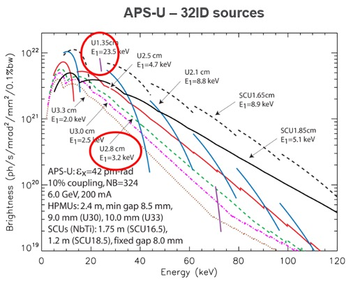
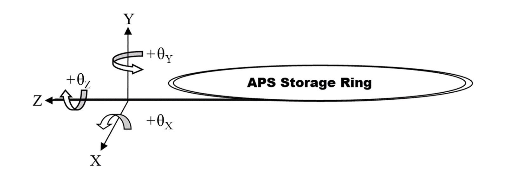

=====
About
=====

32-ID supports three main techniques: monochromatic full-field imaging, white beam (`High Speed <https://docs32id.readthedocs.io/en/latest/source/hsi.html>`_), full-field imaging/diffraction (HSID), and transmission x-ray microscopy (`TXM <https://docs32id.readthedocs.io/en/latest/source/txm.html>`_).

Supported Techniques
--------------------

| • Phase contrast imaging
| • Radiography
| • Transmission x-ray microscopy
| • Tomography
| • Holotomography (in future)

Beamline Specifications
-----------------------

+----------------------+---------------------------------+
|  Source (downstream)   |   Planar 1.35                 |
+----------------------+---------------------------------+
|  Source (upstream) |   Planar 2.8                      |
+----------------------+---------------------------------+
|  Configuration       |   Canted                        |
+----------------------+---------------------------------+
|  Monochromator Type  |   Si(111)                       |
+----------------------+---------------------------------+
|  Energy Range        |   7-40 keV                      |
+----------------------+---------------------------------+
|  Flux (photons/sec)  | :math:`1\times 10^{13} @13` keV |
+----------------------+---------------------------------+
|  Beam Size (HxV)     |   1mm x 2mm (Unfocused)         |
+----------------------+---------------------------------+

32ID Undulators spectra.

BL Coordinate System
--------------------

APS coordinate system.
