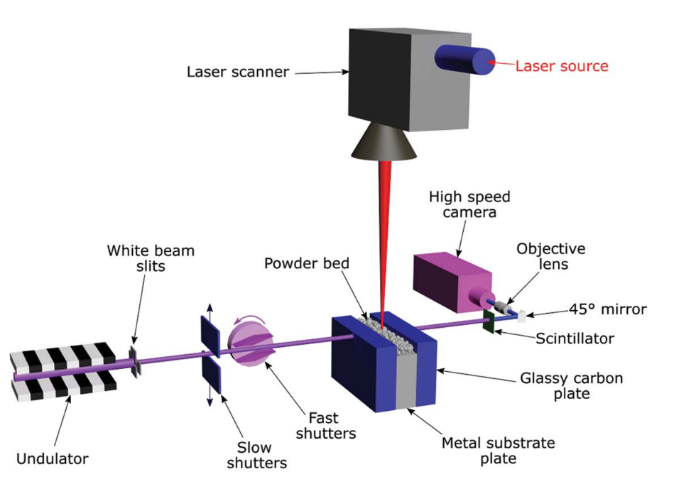

======================
Additive Manufacturing
======================

**In-house powder bed fusion test rig at APS for in situ imaging and diffraction**

`32-ID Docs <https://github.com/xray-imaging/32id-docs>`_ is a website with up-to-date information related to the additive manufacturing activities at sector 32-ID of APS.

| **Contact**
| Sam Clark (sjclark@anl.gov)
| Office phone #: (630)252-6948
| Beamline phone #: (630)252-1832

.. toctree::
   :maxdepth: 1

   AM/about
   AM/publications

   