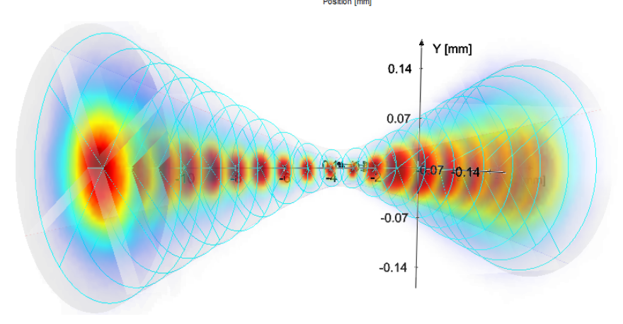

=====
About
=====

**Experimental Setup**

.. image:: ../img/am_rig_photo.png
   :width: 600px
   :align: center
   :alt: Additive Manufacturing

(a) Overview of the 32-ID-B beamline at the APS. (A) Slow shutter, (B) fast shutter, (C) laser AM experimental setup, (D) high-speed X-ray imaging setup, and (E) laser system control computer and laser source rack. 

(b) Detailed view of the setup. (1) High-speed camera, (2) scintillator–mirror–objective lens assembly box, (3) laser feeding fiber and collimator, (4) laser scanner, (5) experimental chamber, (6) connection for the vacuum pump, (7) vacuum- compatible bellows, (8) three-axis translational stages for sample manipulation, and (9) two-axis stage for laser–X-ray alignment. 

(c) A detailed view of the control rack. (i) Scanner control computer, (ii) power sources and connection boxes for the scanner, and (iii) laser source.

.. contents:: Contents:
   :local:

.. list-table:: Instrument Characteristics
   :widths: 25 25 50
   :header-rows: 1

   * - Parameter
     - Value
     - Unit
   * - Max Laser Power
     - :math:`522.6`
     - :math:`W`
   * - Laser Power Range
     - :math:`10-100`
     - :math:`\%`
   * - Laser Emission Wavelength
     - :math:`1070.4`
     - :math:`nm`
   * - Focused Spot Size
     - :math:`~50`
     - :math:`\mu m` 
   * - Maximum Scan Speed
     - :math:`2`
     - :math:`ms^{-1}` 

**Laser Beam Caustic**

     
**Sample Guidance**

The facilitate the highest possible frame rates the samples should attenuate as little of the X-ray beam as possible whilst maintaining suffient contrast on the features to be studied. Below is a figure charting the the attenuation length where the thickness of the sample would block 63% of the incoming X-ray beam intensity. It is possible to use substantially thicker samples than indicated at the compromise of the frame rate.

.. image:: ../img/am_attenuation_length.png
   :width: 300px
   :align: center
   :alt: Additive Manufacturing