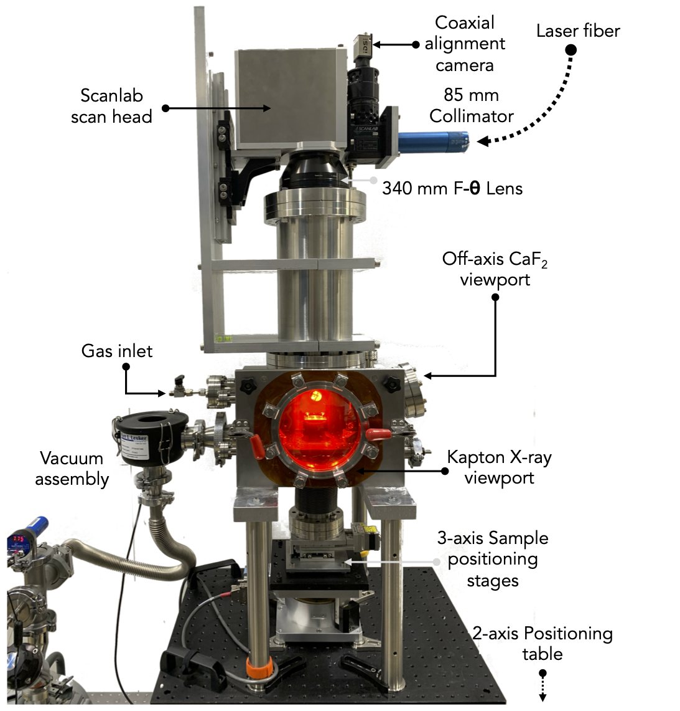
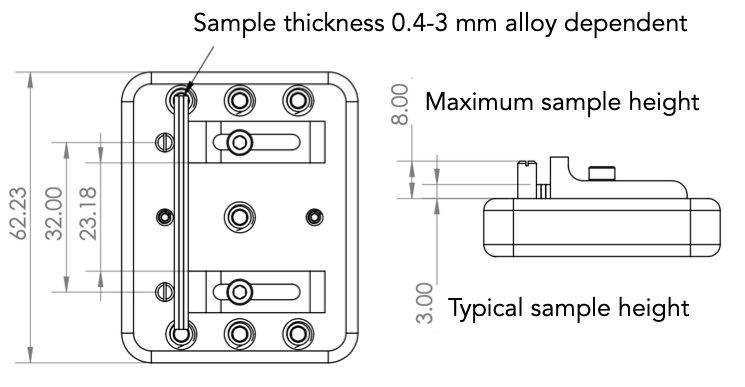

=====
About
=====

**Experimental Setup**

.. list-table:: Instrument Characteristics
   :widths: 25 25 25
   :header-rows: 1

   * - Parameter
     - Value
     - Unit
   * - Max Laser Power
     - :math:`500`
     - W
   * - Laser Power Range
     - :math:`10-100`
     - :math:`\%`
   * - Laser Emission Wavelength
     - :math:`1070`
     - :math:`nm`
   * - Focused Spot Size
     - :math:`50`
     - :math:`\mu m` 
   * - Maximum Scan Speed
     - :math:`1.4`
     - :math:`ms^{-1}`
   * - Operation Modes
     - CW, Pulsed 
     - 
   * - Maximum Pulse Frequency
     - :math:`50`
     - kHz

User lasers can be incorporated on request (speak to beamline staff in order to discuss viability of individual cases).

The beamline has a Cinogy FBP-2KF beam profiler for characterization of the delivered laser power and spot size.

**Sample Guidance**

The facilitate the highest possible frame rates the samples should attenuate as little of the X-ray beam as possible whilst maintaining suffient contrast on the features to be studied. Below is a figure charting the the attenuation length where the thickness of the sample would block 63% of the incoming X-ray beam intensity. It is possible to use substantially thicker samples than indicated at the compromise of the frame rate. In order to avoid melting the whole thickness of the sample for most laser processing conditions samples should be thicker than 400 :math:`\mu m`.

.. image:: ../img/am_attenuation_length.png
   :width: 300px
   :align: center
   :alt: Additive Manufacturing