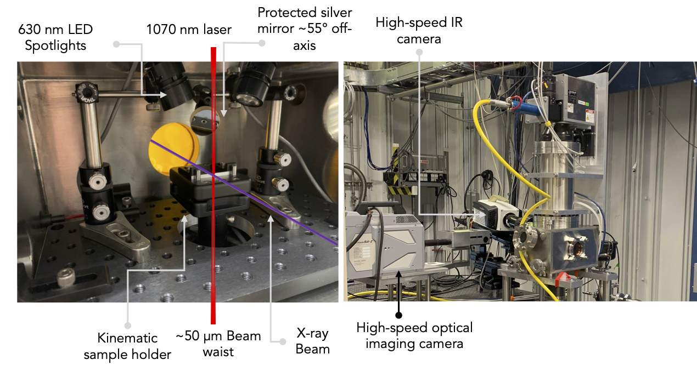

===============
Thermal Imaging
===============

**Experimental Setup**

.. list-table:: Telops  FAST-IR-3K 
   :widths: 25 25 25
   :header-rows: 0

   * - Sensitivity range
     - :math:`3-5`
     - :math:`\mu m`
   * - Pixel size
     - :math:`30`
     - :math:`\mu m`
   * - Long distance microscope
     - :math:`1` X magnification
     - :math:`WD = 259` mm 
   * - Maximum frame rate
     - :math:`3100` (full frame)
     - :math:`100,000` (64x4 pixels)
   * - Radiant temperature range
     - :math:`273` K
     - :math:`2773` K
