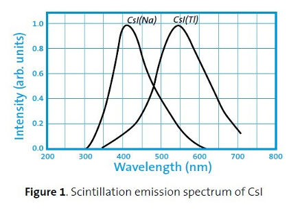
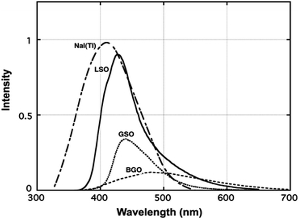

Detection
=========

The detection system consists of camera, lens and scintillator screens. Below we list of all the camera, lens and scintillator screens options available at 32-ID.

Cameras
-------

These are the model/part number of the cameras in use at 32-ID:

.. _Photron:  https://anl.box.com/s/vc7n40d87b7kh16fiw3gjo76m88dq7mu 
.. _Shimadzu:  https://anl.box.com/s/y5a0pxn0l1q5rqfl2yw7audsxwym8emw      
.. _Photron_order:  https://apps.inside.anl.gov/paris/search.jsp
.. _Shimadzu_order: https://apps.inside.anl.gov/paris/req.jsp?reqNbr=G9-281070    

+-------------------------------------------------------------+--------------+------------------+---------+------------+--------------------+
|                   Camera                                    | pixels (HxV) | pixels size (μm) |   bit   | fps        |      Manual        |
+=============================================================+==============+==================+=========+============+====================+
| Photron FastCam SA-Z                                        |              |                  |         |            |     Photron_       |
+-------------------------------------------------------------+--------------+------------------+---------+------------+--------------------+
| Shimadzu Hyper Vision HPV-X2                                |              |                  |         |            |     Shimadzu_      |
+-------------------------------------------------------------+--------------+------------------+---------+------------+--------------------+

The purchase record can be found at Photron_order_, Shimadzu_order_.

Lenses
------

These are the model/part number of the microscope objective available at  at 32-ID:

.. _lens_order_00001: https://apps.inside.anl.gov/paris/req.jsp?reqNbr=F0-144093
.. _lens_order_00002: https://apps.inside.anl.gov/paris/req.jsp?reqNbr=F1-153142
.. _lens_order_00003: https://apps.inside.anl.gov/paris/req.jsp?reqNbr=F1-165089

+-------------+------+------------------+-----------------+
|    Brand    | each |   Part Number    |  Magnification  |
+=============+======+==================+=================+
|  Mitutoyo   |   3x |   NT-46-142      |        2x       | 
+-------------+------+------------------+-----------------+
|  Mitutoyo   |   3x |   NT46-143       |        5x       |
+-------------+------+------------------+-----------------+
|  Mitutoyo   |   3x |   NT66-383       |      7.5x       |
+-------------+------+------------------+-----------------+
|  Mitutoyo   |   3x |   NT46-144       |     10x         |
+-------------+------+------------------+-----------------+
|  Mitutoyo   |   2x |   NT46-145       |     20x         |
+-------------+------+------------------+-----------------+

The purchase record can be found at lens_order_00001_, lens_order_00002_, lens_order_00003_.

Scintillators
-------------

.. _esrf_specs: https://anl.box.com/s/0q3bc124x4ai5pnkt01vmbimduwnubee
.. _esrf_order: https://apps.inside.anl.gov/paris/req.jsp?reqNbr=F6-161076
.. _marketech_order: https://apps.inside.anl.gov/paris/req.jsp?reqNbr=F6-161075
.. _crytur_order_01: https://apps.inside.anl.gov/paris/req.jsp?reqNbr=F3-119046
.. _crytur_order_02: https://apps.inside.anl.gov/paris/req.jsp?reqNbr=F1-153126

+-------------+------------------+-----------------+----------------+---------------------------+-------------------------+
|    Source   |       Type       |  Thickness (μm) |   Size (mm)    |  Specification            |     Order Ref.          |
+=============+==================+=================+================+===========================+=========================+
|     ESRF    |        GGG       |         2       |     8 x 8      |     esrf_specs_           |   esrf_order_           |
+-------------+------------------+-----------------+----------------+---------------------------+-------------------------+
|     ESRF    |        GGG       |         5       |     8 x 8      |     esrf_specs_           |   esrf_order_           |
+-------------+------------------+-----------------+----------------+---------------------------+-------------------------+
|     ESRF    |        GGG       |        23       |     8 x 8      |     esrf_specs_           |   esrf_order_           |
+-------------+------------------+-----------------+----------------+---------------------------+-------------------------+
|     ESRF    |      LOS:Tb      |         6       |     8 x 8      |     esrf_specs_           |   esrf_order_           |
+-------------+------------------+-----------------+----------------+---------------------------+-------------------------+
| Marketech   |     LuAG:Ce      |        100      |     25.4       |          -                |   marketech_order_      |
+-------------+------------------+-----------------+----------------+---------------------------+-------------------------+
| Marketech   |     LuAG:Ce      |        200      |     25.4       |          -                |   marketech_order_      |
+-------------+------------------+-----------------+----------------+---------------------------+-------------------------+
| Crytur      |     LuAG:Ce      |         20      |     10         |          -                |   crytur_order_01_      |
+-------------+------------------+-----------------+----------------+---------------------------+-------------------------+
| Crytur      |     LuAG:Ce      |         25      |     10         |          -                |   crytur_order_01_      |
+-------------+------------------+-----------------+----------------+---------------------------+-------------------------+
| Crytur      |     LuAG:Ce      |         10      |     10         |  glued on 1 mm quartz.    |   crytur_order_01_      |
+-------------+------------------+-----------------+----------------+---------------------------+-------------------------+
| Crytur      |     LuAG:Ce      |         10      |     10         |  glued on 0.17 mm quartz  |   crytur_order_01_      |
+-------------+------------------+-----------------+----------------+---------------------------+-------------------------+
| Crytur      |     LuAG:Ce      |         50      |     25.5       |          -                |   crytur_order_02_      |
+-------------+------------------+-----------------+----------------+---------------------------+-------------------------+

Below are the emission spectrum plots of common scintillator screens:

