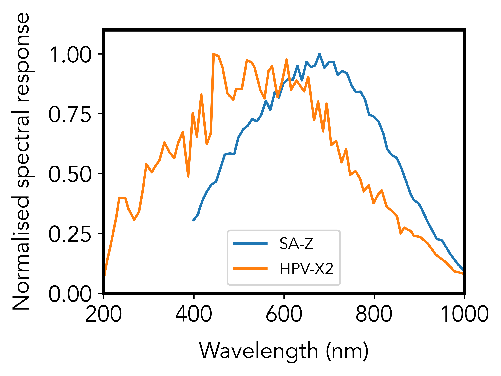
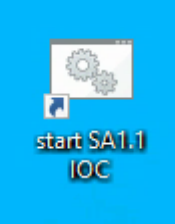
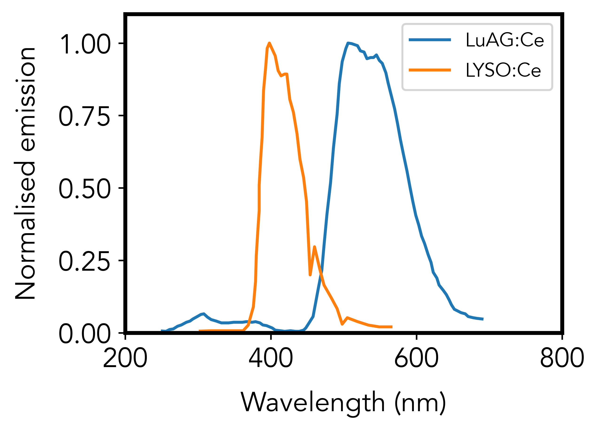
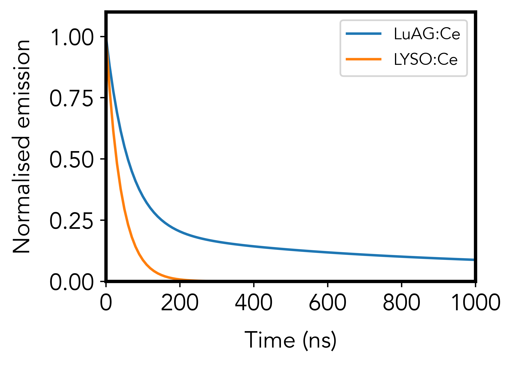

Detection
=========

The detection system consists of camera, lens and scintillator screens. Below we list of all the camera, lens and scintillator screens options available at 32-ID.

Cameras
-------

These are the model/part number of the cameras in use at 32-ID:

.. _Photron_SA1:  https://anl.box.com/s/dl1cn7gra9sqerp1f9u7rd0s8hglctly
.. _Photron_SAZ:  https://anl.box.com/s/vc7n40d87b7kh16fiw3gjo76m88dq7mu 
.. _Shimadzu:  https://anl.box.com/s/y5a0pxn0l1q5rqfl2yw7audsxwym8emw      
.. _Photron_SA1_order:  https://anl.box.com/s/sgm3d7hg0zwlpum8s4jfdru5765op2a4
.. _Photron_SAZ_order:  https://anl.box.com/s/tnq59lqep0egz4i18jxu4i5olx5ikhlx
.. _Shimadzu_order: https://apps.inside.anl.gov/paris/req.jsp?reqNbr=G9-281070    

+-------------------------------------------------------------+--------------+------------------+---------+------------------+--------------------+
|                   Camera                                    | pixels (HxV) | pixels size (μm) |   bit   | fps (full frame) |     Datasheet      |
+=============================================================+==============+==================+=========+==================+====================+
| Photron FastCam SA-Z 2100K                                  | 1024X1024    |        20        |   12    |      20,000      |     Photron_SAZ_   |
+-------------------------------------------------------------+--------------+------------------+---------+------------------+--------------------+
| Photron FastCam SA-1.1                                      | 1024X1024    |        20        |   12    |      5,400       |     Photron_SA1_   |
+-------------------------------------------------------------+--------------+------------------+---------+------------------+--------------------+
| Shimadzu Hyper Vision HPV-X2                                | 400X250      |        32        |   10    |     5,000,000    |     Shimadzu_      |
+-------------------------------------------------------------+--------------+------------------+---------+------------------+--------------------+

The purchase record can be found at Photron_SA1_order_, Photron_SAZ_order_, Shimadzu_order_.

Photron
-------

To use the `Photron areaDetector <https://htmlpreview.github.io/?https://github.com/kmpeters/ADPhotron/blob/master/documentation/PhotronDoc.html>`_ software installed on fusion::

  [usr32idc@txmtwo]$ ~/remote_fusion

then click on this desktop icon:

or open a dos terminal and type::

	cd c:\epics\ioc\32idbSA1\iocBoot\ioc32idbSA1
	start_epics.bat

then run::

	[usr32idc@txmtwo]$ medm -x -macro "P=32idbSA1:, R=cam1:" Photron.adl

to obtain the Photron areadetector main control:

.. image:: ../img/ADPhotron.png 
   :width: 720px
   :align: center
   :alt: tomo_user

To collect an image press Acquire Start.

Lenses
------

These are the model/part number of the microscope objective available at  at 32-ID:

+-------------+------------------+-----------------+
|    Brand    |   Part Number    |  Magnification  |
+=============+==================+=================+
|  Mitutoyo   |   NT-46-142      |     2x          | 
+-------------+------------------+-----------------+
|  Mitutoyo   |   NT46-143       |     5x          |
+-------------+------------------+-----------------+
|  Mitutoyo   |   NT66-383       |     7.5x        |
+-------------+------------------+-----------------+
|  Mitutoyo   |   NT46-144       |     10x         |
+-------------+------------------+-----------------+
|  Mitutoyo   |   NT46-145       |     20x         |
+-------------+------------------+-----------------+

Scintillators
-------------

+-------------+------------------+-----------------+----------------+
|    Source   |       Type       |  Thickness (μm) |   Size (mm)    |
+=============+==================+=================+================+
| Crytur      |     LuAG:Ce      |        100      |     10         |   
+-------------+------------------+-----------------+----------------+
|  ~          |     LYSO:Ce      |        100      |     10         |
+-------------+------------------+-----------------+----------------+

Below are the emission spectra plots of the scintillator screen materials using data from :cite:`Rutherford2016` and :cite:`Olbinado2017`:

References
~~~~~~~~~~

.. bibliography:: bibtex/scintilators.bib
   :style: reversedate
   :labelprefix: S
   :all: