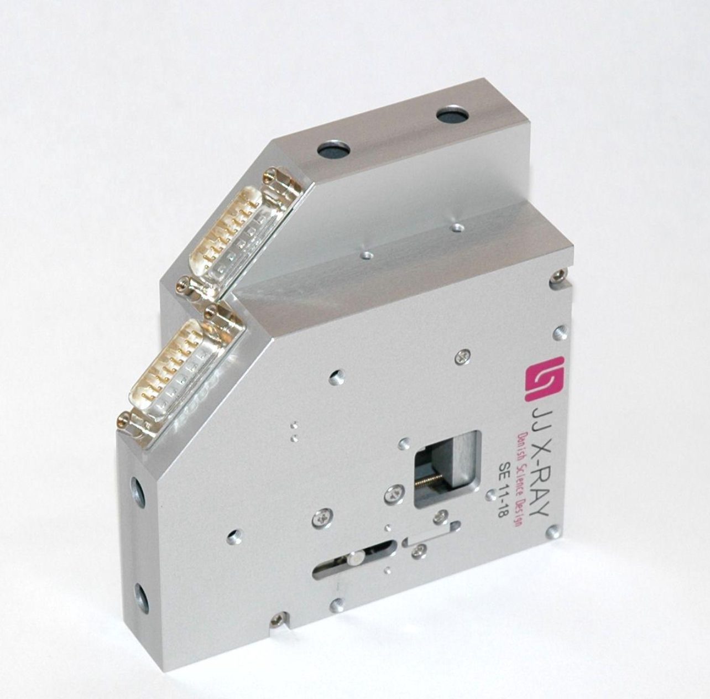

JJ X-RAY
========

The JJ X-Ray slits were designed and developed to meet the demand for compact, reliable, and high-precision slits with sub-micron resolution. The system features four motors that control both the position and the aperture opening. For each dimension, one motor adjusts the aperture size while the other sets its position. This design offers a significant advantage for high-precision scans with a fixed aperture, as only a single motor needs to be moved during a one-dimensional scan, minimizing mechanical variability and enhancing stability.

Documentation
-------------

- `Brief instructions <https://anl.box.com/s/zodiozpwv75x34trpfcib3paasxdt3kv>`_
- `User manual <https://anl.box.com/s/dftmhsi0iu68u3bluwkbs13fou4xw7p3>`_
- `Beckhoff motor controller <https://anl.box.com/s/vk05r2z6amijoxv69fzm46obrj7ikomx>`_
- `Patch cables <https://anl.box.com/s/lcf5l9ezcordiga01wduqbktrhci5zpi>`_

