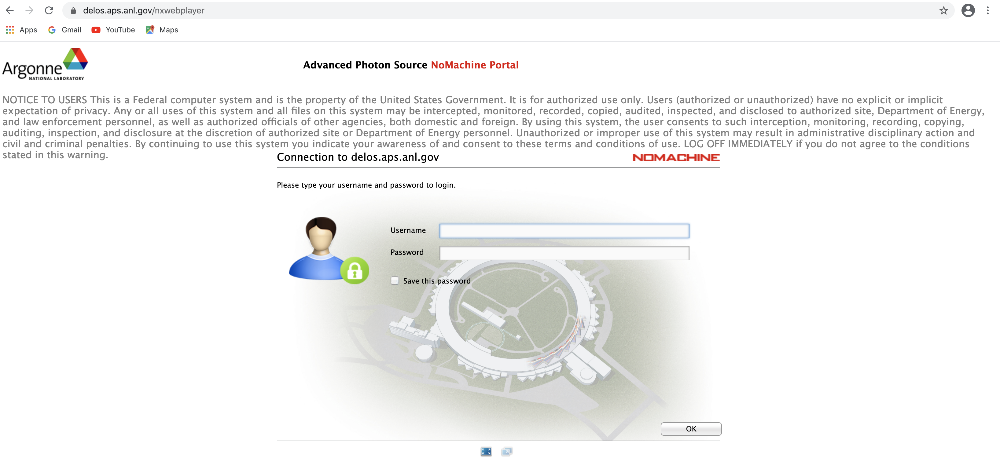
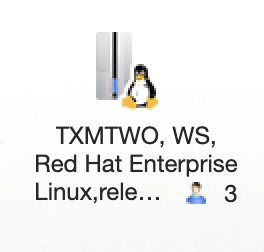
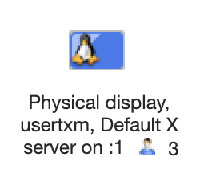
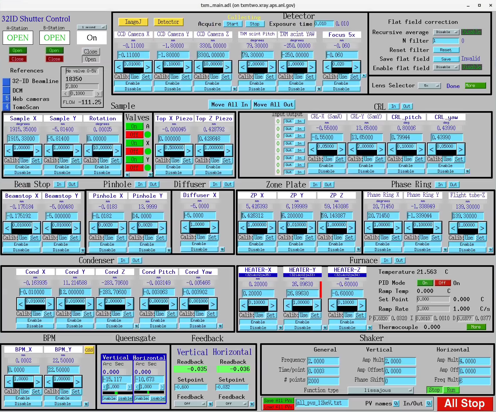

Remote access
=============

Remote access to beamline control computers is granted to users having a valid badge number and an active/scheduled proposal. 
To connect to 32-ID main control system please go to https://delos.aps.anl.gov and login using as user name d+badge number 
and the password you use to submit your APS prosal, then select "TXMTWO, WS, Red Hat Enterprise Linux Workstation".

Once connected you have full control of the nano tomography system via the usual user interface:

