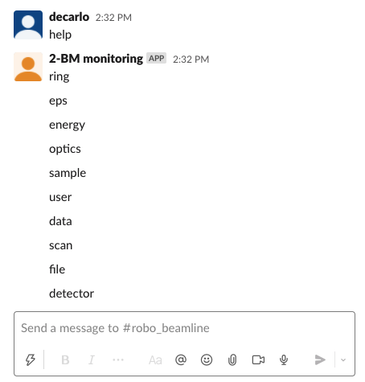
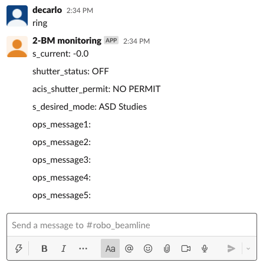
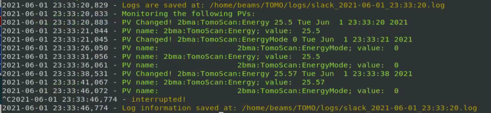
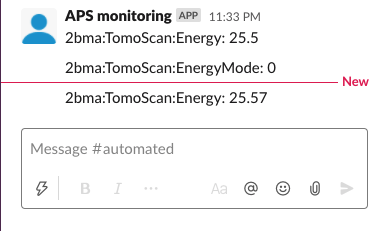

.. _Slack GUP: https://github.com/xray-imaging/slack-gup
.. _share instructions: https://github.com/xray-imaging/slack-gup#share
.. _Slack bot: https://github.com/xray-imaging/slack-bot
.. _pv logger: https://github.com/xray-imaging/pv

Slack
=====

There are several tools support Slack integration with the beamline opereration, these include:

slack gup
---------

`Slack GUP`_ Creates a slack channel using General User Proposal (GUP) number (GUP-#) and invites in the channel all users listed in the proposal. To use **slack gup**

::

    (slack) usertxm@txmtwo ~ $ slack gup

    2021-11-19 14:49:19,977 - 2021-11-19 20:49:19.977194+00:00
    2021-11-19 14:49:19,977 - Found valid proposal id
    2021-11-19 14:49:20,202 - 2021-11-19 20:49:20.202317+00:00
    2021-11-19 14:49:20,202 - GUP proposal_id: 75438
    2021-11-19 14:49:20,410 - 2021-11-19 20:49:20.410172+00:00
    2021-11-19 14:49:20,410 - Found valid proposal start time
    2021-11-19 14:49:20,410 - Proposal starting date: 2021_11_19
    2021-11-19 14:49:20,634 - 2021-11-19 20:49:20.633961+00:00
    2021-11-19 14:49:20,634 - Found valid experimenters
    2021-11-19 14:49:20,634 - Proposal PI: judge
    2021-11-19 14:49:20,856 - 2021-11-19 20:49:20.856787+00:00
    2021-11-19 14:49:20,857 - Found valid experimenters
    2021-11-19 14:49:20,857 - Added kkumar26@uic.edu to the e-mail list.
    2021-11-19 14:49:20,857 - Added eallen28@uic.edu to the e-mail list.
    2021-11-19 14:49:20,857 - Added mdato2@uic.edu to the e-mail list.
    2021-11-19 14:49:20,857 - Added roy.indrani1996@gmail.com to the e-mail list.
    2021-11-19 14:49:20,857 - Added jcabana@uic.edu to the e-mail list.
    2021-11-19 14:49:20,857 - Added wjudge2@uic.edu to the e-mail list.
    2021-11-19 14:49:20,858 - Found valid emails
    2021-11-19 14:49:21,284 - Created slack channel: 2021_11_19_judge_gup_75438
    2021-11-19 14:49:21,284 - Please invite to the slack channel 32_id_c_2021_11_19_judge_gup_75438 these users ['kkumar26@uic.edu', 'eallen28@uic.edu', 'mdato2@uic.edu', 'roy.indrani1996@gmail.com', 'jcabana@uic.edu', 'wjudge2@uic.edu', 'vnikitin@anl.gov', 'decarlo@anl.gov']
    2021-11-19 14:49:21,284 - General
    2021-11-19 14:49:21,284 -   config           /home/beams/USERTXM/slack.conf
    2021-11-19 14:49:21,285 -   verbose          True
    2021-11-19 14:49:21,285 - Settings
    2021-11-19 14:49:21,285 -   beamline         32_id_c
    2021-11-19 14:49:21,285 -   set              0.0
    2021-11-19 14:49:21,285 - Beamline contacts
    2021-11-19 14:49:21,286 -   primary_beamline_contact_email vnikitin@anl.gov
    2021-11-19 14:49:21,286 -   secondary_beamline_contact_email decarlo@anl.gov

to share the newly created channels with the proposal listed above follow the `share instructions`_.

For help::

  (slack) usertxm@txmtwo ~ $ slack gup -h
  usage: slack gup [-h] [--beamline {None,2_bm,7_bm,8_id_i,20_bm,29_id,32_id_b,32_id_c}] [--set SET]
                   [--primary-beamline-contact-email FILE] [--secondary-beamline-contact-email FILE] [--config FILE]
                   [--verbose]

  optional arguments:
    -h, --help            show this help message and exit
    --beamline {None,2_bm,7_bm,8_id_i,20_bm,29_id,32_id_b,32_id_c}
                          When set adds the beamline name as a prefix to the slack channel name (default: None)
    --set SET             Number of +/- number days for the current date. Used for setting a channel for past/future user
                          groups (default: 0)
    --primary-beamline-contact-email FILE
                          Beamline scientist email (default: pshevchenko@anl.gov)
    --secondary-beamline-contact-email FILE
                          Beamline scientist email (default: decarlo@anl.gov)
    --config FILE         File name of configuration (default: /home/beams/USERTXM/slack.conf)
    --verbose             Verbose output (default: True)

slack bot
---------

`Slack bot`_ automatical responds to predefined keywords, i.e. **ring**, **energ**, **users** etc., returning a list of PV name/value associated with that keywords. 

To start the slack bot server:

::

    $ slackbot start --beamline 2-bm --channel-name automated
      Bolt app is running!

usage:

pv logger
---------

`pv logger`_ provides an EPICS PV logger with slack support

setup:

::

    (slack) usertxm@txmtwo $ pv set --pv-list "2bma:TomoScan:Energy, 2bma:TomoScan:EnergyMode"

usage:

