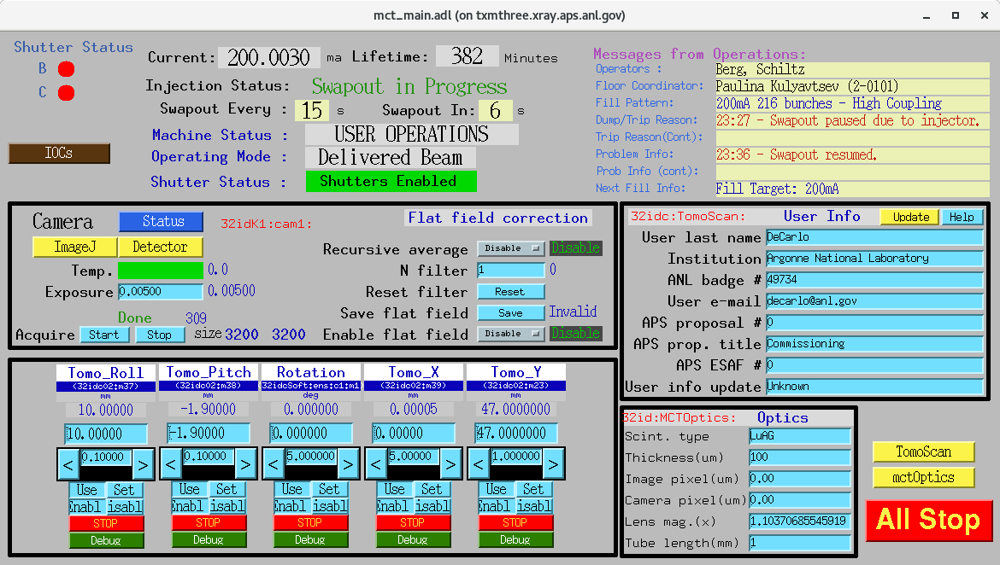
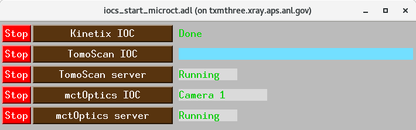
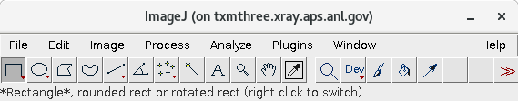
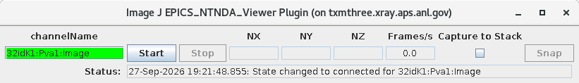

================
Beamline control
================

All beamline components and detectors are controlled using
`EPICS <https://epics-controls.org/>`_ and
`areaDetector <https://areadetector.github.io/master/index.html>`_.

Each device can be configured and controlled either through a graphical
user interface (GUI) or from Python using
`PyEpics <https://cars9.uchicago.edu/software/python/pyepics3/>`_.

To start the main 32-ID-C Micro-CT control screen, run::

  (base) usertxm@txmthree ~ $ start_tomo

``start_tomo`` lives in ``~/scripts``, which is already on ``PATH``. Besides
opening the screen it sets ``EPICS_DISPLAY_PATH`` so the related displays
resolve, and the Channel Access and pvAccess address lists so the accelerator,
motor and image PVs are reachable. Those settings are scoped to the screen: it
does not change the EPICS environment of anything already running.

.. note::

   Every panel above should carry values. A white field means the IOC behind
   it is down -- use the ``IOCs`` button to check and restart it.

   The one exception is the *Scan status* field on the ``IOCs`` screen, which
   is blank until a scan has run. It is a 256-character waveform and is empty
   after an IOC restart.

.. warning::

   Two widgets on this screen are known to be wrong and will be fixed:

   * **Update** (in the User Info panel) has no script behind it yet and does
     nothing when pressed.

   * **Temp.** reads ``TemperatureActual``, which the ADKinetix driver never
     writes -- it publishes the sensor temperature to ``Temperature_RBV``
     instead. The indicator therefore stays green whatever the camera is
     doing. Do not read it as evidence that the detector is cool.

What the screen provides
========================

.. list-table::
   :header-rows: 1
   :widths: 26 74

   * - Area
     - Contents
   * - Top left
     - Shutter status for the B and C stations, and the ``IOCs`` button.
       Green is open, red is closed.
   * - Top right
     - APS machine status -- ring current, lifetime, injection and swapout,
       operating mode, shutter status -- and the Operations message board.
   * - Camera
     - Detector status and control, exposure, acquisition, frame size and
       flat-field correction. ``Detector`` opens the ADKinetix screen,
       ``Status`` the detector status panel, and ``ImageJ`` the image viewer.
   * - User Info
     - ``32idc:TomoScan:`` metadata written into the data files.
   * - Optics
     - ``32id:MCTOptics:`` scintillator, lens and pixel-size metadata, also
       written into the data files.
   * - Bottom
     - Motor panels for the rotation stage and the four sample-stack axes.
   * - Right
     - ``TomoScan`` and ``mctOptics`` open the two server screens.
       ``All Stop`` stops every motor.

.. note::

   The shutter panel is **status only**. Beam is admitted to 32-ID-C by the
   32-ID-B shutter, which can only be operated from an authorised host, so no
   control is offered here. tomoScan opens and closes it itself during a scan.

Sample stack
============

The station has four real translation and alignment axes, all served by the
``32idc02:`` motor IOC, plus the rotation stage on the ``32idcSoft:`` soft IOC:

.. list-table::
   :header-rows: 1
   :widths: 22 30 48

   * - Panel
     - PV
     - Function
   * - Rotation
     - ``32idcSoft:ens:c1:m1``
     - Aerotech ABRS-150MP air-bearing rotary stage
   * - Tomo_X
     - ``32idc02:m39``
     - Horizontal translation, used for the 0/180 offset
   * - Tomo_Y
     - ``32idc02:m23``
     - Vertical translation
   * - Tomo_Pitch
     - ``32idc02:m38``
     - Alignment tilt
   * - Tomo_Roll
     - ``32idc02:m37``
     - Alignment tilt

.. note::

   There is no Z translation on the Micro-CT sample stack. A ``Tomo_Z``
   record exists on the motor IOC but is not wired to any stage -- it is a
   placeholder the optics server requires in order to start -- and it is
   deliberately left off this screen.

IOCs
====

The ``IOCs`` button opens a panel for starting and stopping the software
behind the screen:

One row per process. The wide button in the middle starts it, the red ``Stop``
on the left stops it, and the field on the right reports its state:

.. list-table::
   :header-rows: 1
   :widths: 30 70

   * - Row
     - What it runs
   * - Kinetix IOC
     - The camera IOC, on ``maxwell``
   * - TomoScan IOC
     - The tomoScan soft IOC, on ``maxwell``
   * - TomoScan server
     - The Python server that drives it -- reads *Running* when up
   * - mctOptics IOC
     - The optics IOC -- reports the selected camera when up
   * - mctOptics server
     - The Python optics server -- reads *Running* when up

Start them in that order. The tomoScan server reads the optics configuration
when it starts, so if mctOptics is not up it logs
``mctOptics is down. Please start mctOptics first`` and the camera and file
plugin prefixes are never registered.

.. note::

   Each button opens a terminal window and the process runs in the foreground
   of it. Closing that window, or losing the network to ``maxwell``, stops the
   process. Leave the windows open for the duration of the experiment.

Viewing the live image
======================

The ``ImageJ`` button opens ImageJ:

Select **Plugins → EPICS areaDetector → EPICS NTNDA Viewer**, set the channel
name to ``32idK1:Pva1:Image`` and press **Start**:

A green channel name means the PV was found. Frames only appear once the
camera is acquiring *and* the plugin chain feeding ``Pva1`` is enabled; if the
viewer reports ``updateImage failed`` with the name still green, the channel
exists but no array has reached it yet.

.. important::

   Use the **NTNDA** viewer, not ``EPICS AD Viewer``. The two look similar but
   the plain AD viewer uses Channel Access, and one full Kinetix frame is
   3200 x 3200 x 2 = 20.5 MB -- larger than the Channel Access array limit in
   use here. pvAccess has no such limit, which is why the channel to open is
   ``Pva1:Image`` rather than ``image1``.

.. note::

   ImageJ runs on whatever machine the screen was started from, so the frames
   cross the network from ``maxwell``. That is the intended arrangement.
   Starting the screen on ``maxwell`` instead keeps the stream local to the
   machine holding the camera, which is worth knowing if bandwidth ever
   becomes the limit.
