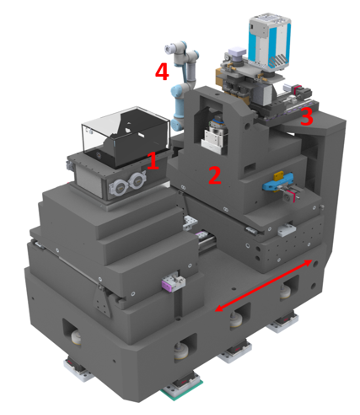

=====================
Projection Microscope
=====================

The in-house Projection X-ray Microscope of APS

Projection microscope design. 1) KB mirrors system, under Helium atmosphere – (X, Y); 2) Sample air bearing positioning stage – (Kx, Y, Kz, KYaw); 3) Triple magnification dual camera indirect detection system – (Kx, Ky, KYaw, KPitch). 4) Support for a robotic arm for automatic sample exchange. The red arrow depicts the motion of the sample positioning assembly. 

.. toctree::
   :maxdepth: 1

   pm/about
   pm/overview
   pm/manual
   pm/troubleshoot
   pm/publications
   pm/components
   

