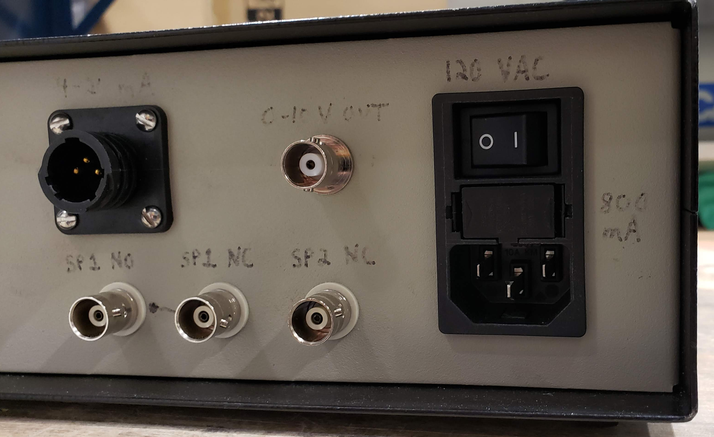

===============================
Guide to Home-Built Electronics
===============================

Custom-built electronics are a part of many experiments at APS.  Argonne takes electrical safety seriously, and all electronics that will handle > 50 V require an inspection to show that they can safely be operated.  Many custom-built electronic units are built by researchers themselves who often lack training in electrical work.  Based on past experience, poor construction of electronics can lead to significant delays in experiments for users, limitations on experiments, and extra work for beamline staff and electrical inspectors.

This document is meant to serve as a guide to users on what to do to make sure there are no undue delays in their experiments due to electrical inspection issues.

Requirements
------------

* Make sure that all components in the box are fixed in place, including connectors protruding from the box.  Loose components mean an almost automatic rejection.
* Don’t put unnecessary materials in the box.  Padding with flammable materials (paper towels or foam) will lead to an almost automatic rejection.
* Ensure there is sufficient space around components in the box.  If any components will dissipate heat, ensure sufficient ventilation.
* Make sure there is fusing for the power input that is appropriate for the equipment being powered.
* For metal enclosures, make sure that the enclosure is grounded to the power input ground, and that any exposed metal (connectors, etc.) and all internal subsystems are properly bonded to the equipment ground as well.
* Make sure to use NRTL components for those components that will see > 50 V.
* The wires and components need to be rated for the maximum voltage/amperage they carry.
* Connectors and plugs need to be labeled with their function and voltage.  
* Try to follow standard wire color schemes.  Green wires should only be used for ground conductors.  White wires should only be used for neutral wires.
* Ground wires are to protect workers and equipment.  DO NOT deliberately flow current through ground wires.
* Shrink wrap exists to cover exposed metal to improve safety, not to hide flaws in wiring.  For example, below is a 110 VAC conductor where the wires were simply twisted together and covered with shrink wrap, rather than being properly joined (solder or crimp connectors would have been suitable here).  This is not acceptable practice. 

.. image:: img/bad_wiring_shrink_wrap.png
   :width: 640px
   :align: center
   :alt: Example of poor wiring practice

Design Suggestions
------------------
* Avoid making custom-built electrical enclosures using voltages > 50 V.  For example, use an external NRTL-listed power supply to feed a box with low-voltage DC rather than making an enclosure with an AC input and a DC converter inside.  While a box with only < 50 V still needs to be well-built, it does not require an electrical inspection.
* In the same vein, don’t unnecessarily mix low and high voltage equipment.  
* Use standard connectors.  You are more likely to be able to find spares if rewiring is needed.  Bring extra connectors with you in case changes are needed.  If a connector will handle > 50 V, make sure it is NRTL listed.
* Don’t use standard connectors in non-standard ways.  For example, don’t use a standard power cord plug for components that aren’t going to be connected to 110 VAC.  
* Use terminal strips inside of the enclosure so that if things need to be rewired, it can be done more easily.  If wires are directly connected between cables entering the box, it makes it very difficult to trace connections or modify the wiring if needed.  This example is from an enclosure built by an APS scientific associate.  Note how the terminal strip aids in both tracing wires and in making modifications to the wiring.

.. image:: img/terminal_strip.png
   :width: 640px
   :align: center
   :alt: Example of poor wiring practice

* Consider using power entry modules rather than a power cord end with a grommet.  It makes for a cleaner, safer assembly.  For example, note the power entry module shown below.  It provides a power switch, fusing, and an interface to a standard computer power cord.  

* Consider using wire-end ferrules when using stranded wire.  It makes for a much cleaner termination into terminal blocks.

.. image:: img/bare_wires.png
   :width: 640px
   :align: center
   :alt: Example of poor wiring practice
 

.. image:: img/wire_ferrule.png
   :width: 640px
   :align: center
   :alt: Example of poor wiring practice
