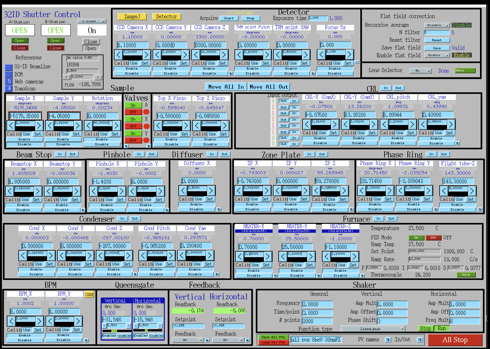

Beamline Control
================

All beamline components and detectors are controlled using `EPICS <https://epics-controls.org/>`_ and `areaDetector <https://areadetector.github.io/master/index.html>`_.
Each device can be configure and controlled through a graphic user interface (GUI) or through a python script using `PyEpics <https://cars9.uchicago.edu/software/python/pyepics3/>`_.

Beamline
--------

To start the main 32-ID beamline control user interface with txmoptics and tomoscan IOCs ::

    [usertxm@txmtwo]$ start_txm.sh

   
To start just the main 32-ID beamline control user interface (no IOC restart)::

    [usertxm@txmtwo]$ start_txm_gui.sh

To start the 32-ID beamline control for users (limited functionality, no IOC restart)::

    [usertxm@txmtwo]$ start_txm_gui.sh

.. image:: img_guide/txm_main_user.png
   :width: 1000px
   :align: center
   :alt: project

List of the TXM related IOCs at 32 ID
=====================================

+---------------+------------------------+-------------------------------------------------------------------------------------------------+
|        Name   |       server           |                                                 Description                                     |
+===============+========================+=================================================================================================+
|  32idPLC      |   usr32idc@32idcws     | DIGITAL runs the granite stage air valves and CRL actuators and DAC runs He valve operation     |
+---------------+------------------------+-------------------------------------------------------------------------------------------------+
|  32idbSOFT    |   usr32idc@32idbws     | New Focus drivers in B and C stations                                                           |
+---------------+------------------------+-------------------------------------------------------------------------------------------------+
|  32idcTEMP    |   usr32idc@32idcws     | PTC-10 temp controller for a furnace and other thermocouples                                    |
+---------------+------------------------+-------------------------------------------------------------------------------------------------+
|  32idcBPM     |   usr32idc@s32bcda     | SYDOR BPM (s32bcda is under rh7)                                                                |
+---------------+------------------------+-------------------------------------------------------------------------------------------------+
|  32idcMC      |   usr32idc@postulate   | capillary shaker IOC                                                                            |
+---------------+------------------------+-------------------------------------------------------------------------------------------------+
|  32idcMCS2    |   usr32idc@postulate   | Smaract IOC                                                                                     |
+---------------+------------------------+-------------------------------------------------------------------------------------------------+
|  32idcUC8     |   usr32idc@sec32lt04   | Agilent pico driver for focusing scintilators                                                   |
+---------------+------------------------+-------------------------------------------------------------------------------------------------+

Tomography
==========

For tomographic data acqusition select TomoScan in the top left part of the main txm gui. TomoScan is a general interface for tomographic scanning at 2-BM, 7-BM, 13-BM, and 32-ID (https://tomoscan.readthedocs.io/en/latest/)   

.. image:: img_guide/tomoscan.png
   :width: 400px
   :align: center
   :alt: project

