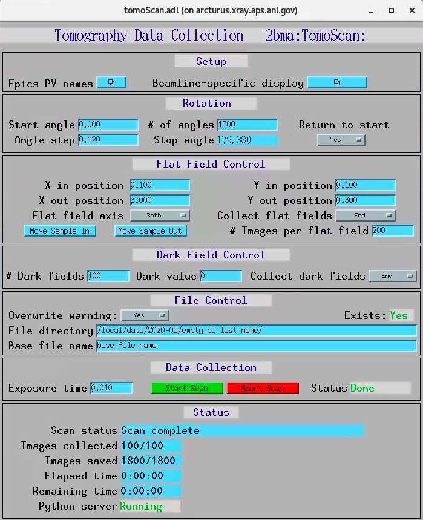

Beamline Control
================

All beamline components and detectors are controlled using `EPICS <https://epics-controls.org/>`_ and `areaDetector <https://areadetector.github.io/master/index.html>`_.
Each device can be configure and controlled through a graphic user interface (GUI) or through a python script using `PyEpics <https://cars9.uchicago.edu/software/python/pyepics3/>`_.

Main interface
--------------

To start the main TXM control user interface with txmOptics, tomoScan IOCs and associated python servers ::

    [usertxm@txm4]$ start_txm.sh

.. image:: img_guide/txm_main.png
   :width: 1000px
   :align: center
   :alt: project
   
To start the 32-ID beamline control for users (limited functionality, no IOC restart)::

    [usertxm@txmtwo]$ start_txm_gui.sh

.. image:: img_guide/txm_main_user.png
   :width: 1000px
   :align: center
   :alt: project

Other EPICS IOCs
----------------

The TXM instrument relies on several hardware components, all supported by EPICS. If you see any white field in the main TXM control user 
interface, it means the associated EPICS IOC is not running. To start/stop/check the status of each IOC use the table below to ssh in the 
corresponding server and run the corresponding command using the following::

   [username@server] $ IOC-name status
   [username@server] $ IOC-name start
   [username@server] $ IOC-name stop

+---------------+------------------------+-------------------------------------------------------------------------------------------------+
|    IOC-Name   |       server           |                                                 Description                                     |
+===============+========================+=================================================================================================+
|  32idPLC      |   usr32idc@32idcws     | DAC: runs the granite stage air valves, CRL actuators and He valve operation                    |
+---------------+------------------------+-------------------------------------------------------------------------------------------------+
|  32idcSOFT    |   usr32idc@32idbws     | Scintillator pitch/yaw for 5x, 10x lenses, phase ring (x), Sample (x), BPM(y)                   |
+---------------+------------------------+-------------------------------------------------------------------------------------------------+
|  32idcTEMP    |   usr32idc@32idcws     | PTC-10 temperature controller for a furnace and other thermocouples                             |
+---------------+------------------------+-------------------------------------------------------------------------------------------------+
|  32idcBPM     |   usr32idc@s32bcda     | SYDOR BPM (rh7)                                                                                 |
+---------------+------------------------+-------------------------------------------------------------------------------------------------+
|  32idcMC      |   usr32idc@postulate   | Condenser shaker (windows)                                                                      |
+---------------+------------------------+-------------------------------------------------------------------------------------------------+
|  32idcMCS2    |   usr32idc@postulate   | MicroCT motors for lens box focusing (windows)                                                  |
+---------------+------------------------+-------------------------------------------------------------------------------------------------+
|  32idcUC8     |   usr32idc@sec32lt04   | Agilent pico driver for focusing scintilators (5x,1 0x)                                         |
+---------------+------------------------+-------------------------------------------------------------------------------------------------+
|  32idb        |   usr32idc@32idbws     | CRL (x, y, pitch, yaw), Queensgate (vertical, horizontal)                                       |  
+---------------+------------------------+-------------------------------------------------------------------------------------------------+
|  32idc01      |   ioc32idc01           | Pinhole (x, y), diffuser (x)                                                                    |
+---------------+------------------------+-------------------------------------------------------------------------------------------------+
|  32idc02      |   ioc32idc02           | Furnace (x, y, z) (Kohzu)                                                                       |
+---------------+------------------------+-------------------------------------------------------------------------------------------------+
|  32idcMCS2    |   usr32idc@32idcws     | Condenser (x, y, z, pitch, yaw), beamstop (x, y), zone plate (x, y, z), phase ring (y)          |
+---------------+------------------------+-------------------------------------------------------------------------------------------------+

32-ID beamline control
----------------------

For opening the main 32-ID beamline control user interface (caQTdm), select **32-ID Beamline** in the top left part of the main TXM gui.

.. image:: img_guide/medm_main_window.png
   :width: 700px
   :align: center
   :alt: project

Tomography
----------

For tomographic data acqusition, select **TomoScan** in the top left part of the main txm gui. `TomoScan <https://tomoscan.readthedocs.io/en/latest/>`_ is a general interface for tomographic scanning in use at seveal beamlines at the APS (2-BM, 7-BM, 13-BM, and 32-ID):

