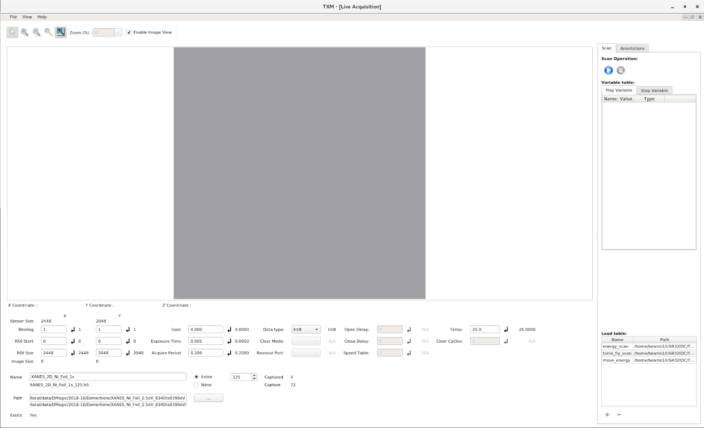

Starting the GUI 
================

Open a terminal::

    $ bash
    $ cd ~/TXM_UI/
    $ ./tomography.sh

The following window will open:

Now, to open the window controlling the stages, go in <View> <Beamline calibration> menu
This new window will open:

.. image:: img_guide/GUI_main_control_window.png
   :width: 1200px
   :align: center
   :alt: project

To load a scan script like "tomo_step_scan.py" or "tomo_fly_scan.py", click on the “+” button on the lower right corner of the main window.

Scan scripts are in this location::

    $ cd /home/beams/USR32IDC/TXM_control/pg/

**Note:** scanning scripts can be run directly from python::
    
    $ /local/usr32idc/Anaconda/bin/python tomo_fly_scan.py

or directly from spyder.
