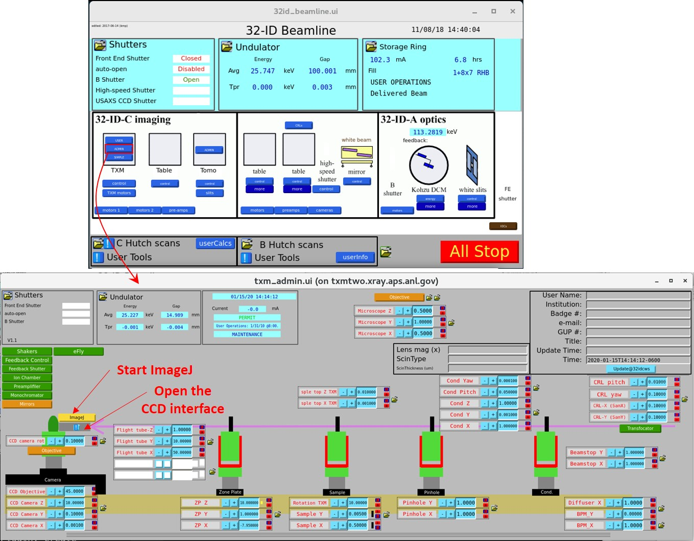
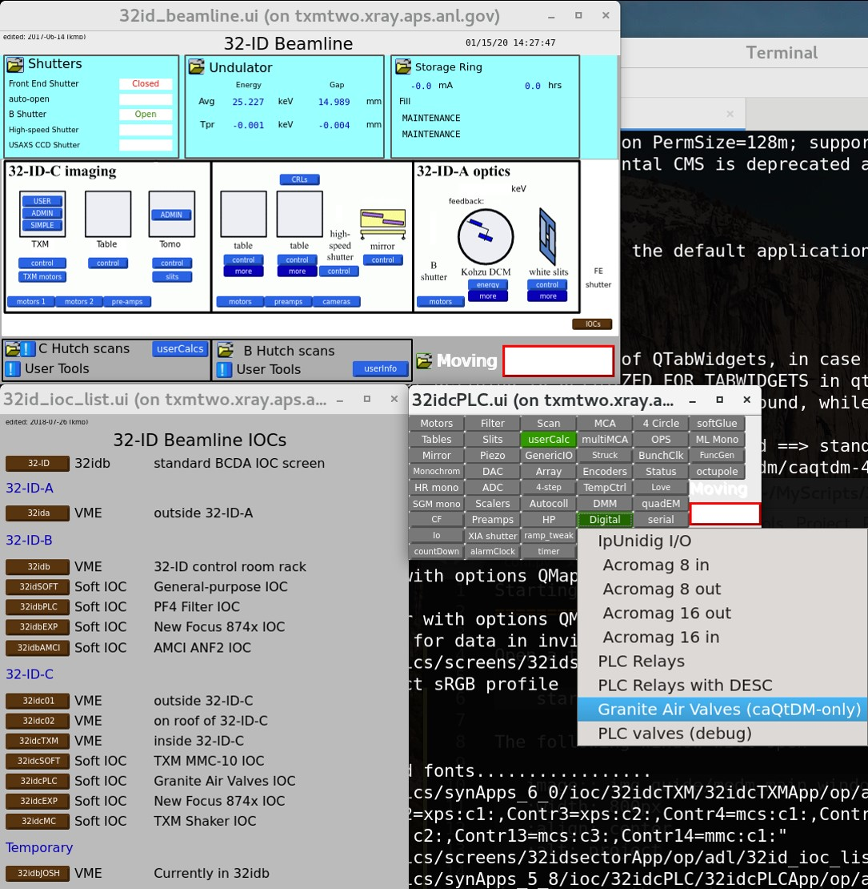
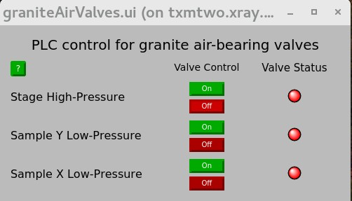

EPICS screens 
=============

To open the EPICS screens, one needs first to start **caQtDM**.

Open a terminal and type::

    $ start_caQtDM_32id

The window "32id_beamline.ui" will open. 

.. image:: img_guide/medm_main_window.png
   :width: 1200px
   :align: center
   :alt: project

| **More control**
| To open the window offering more control options, click on "Admin".
| From there, it is possible to restart ImageJ or the interface for the control of the camera by pushing the button shown in the screenshot.

**Air pressure for the sample stage**

| 1) In the window entitled “"32id_beamline.ui", click on the brown button “IOC’s”
| 2) click on the brown button “32idcPLC”
| 3) click on “Digital”
| 4) click on “Granite Air Valves (caQtDM-only)”

