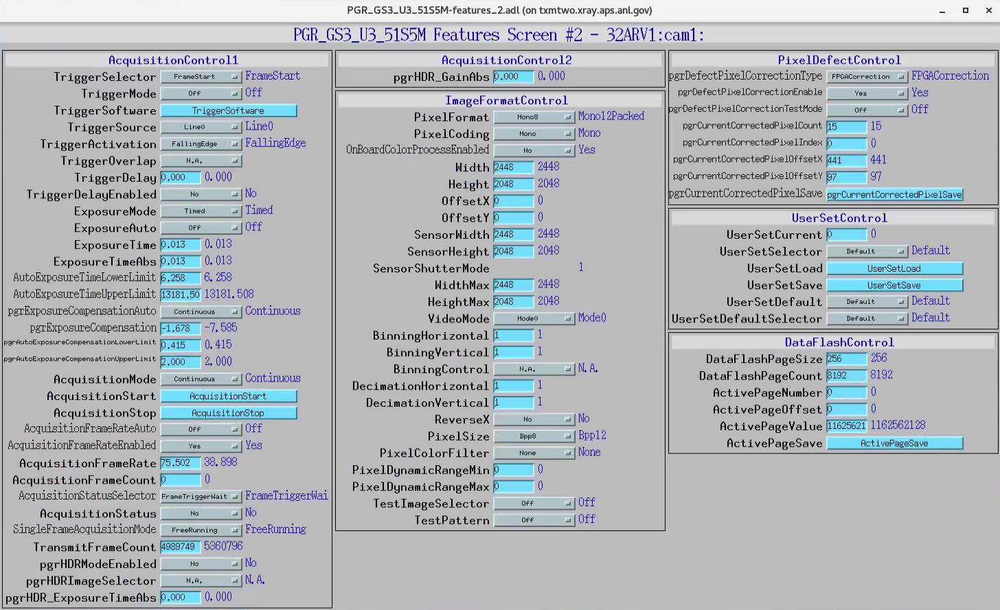
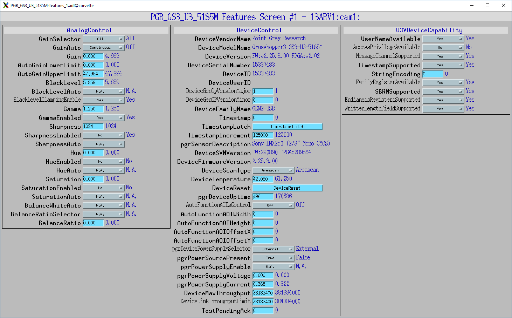

Detector
========

Open a terminal

First, check the status typing::

	[usertxm@txmtwo]$ 32ARV2 status

Then, stop the IOC::

	[usertxm@txmtwo]$ 32ARV2 stop

Restart the IOC::

	[usertxm@txmtwo]$ 32ARV2 start

the detector medm screen is accessible with::

   [usertxm@txmtwo]$ 32ARV2 medm

or by selecting **detector** from the main TXM medm screen.

Note: old version of AreaDetector for the TXM camera is accassible using **32ARV1** alias.

32-ID screens
-------------

.. image:: ../img/ADAravis_32-ID_screen0.png
   :width: 320px
   :align: center
   :alt: 

.. image:: ../img/ADAravis_32-ID_screen1.png
   :width: 320px
   :align: center
   :alt: 

13-BM screens
-------------

.. image:: ../img/ADAravis_13-BM_screen2.png
   :width: 320px
   :align: center
   :alt: 

