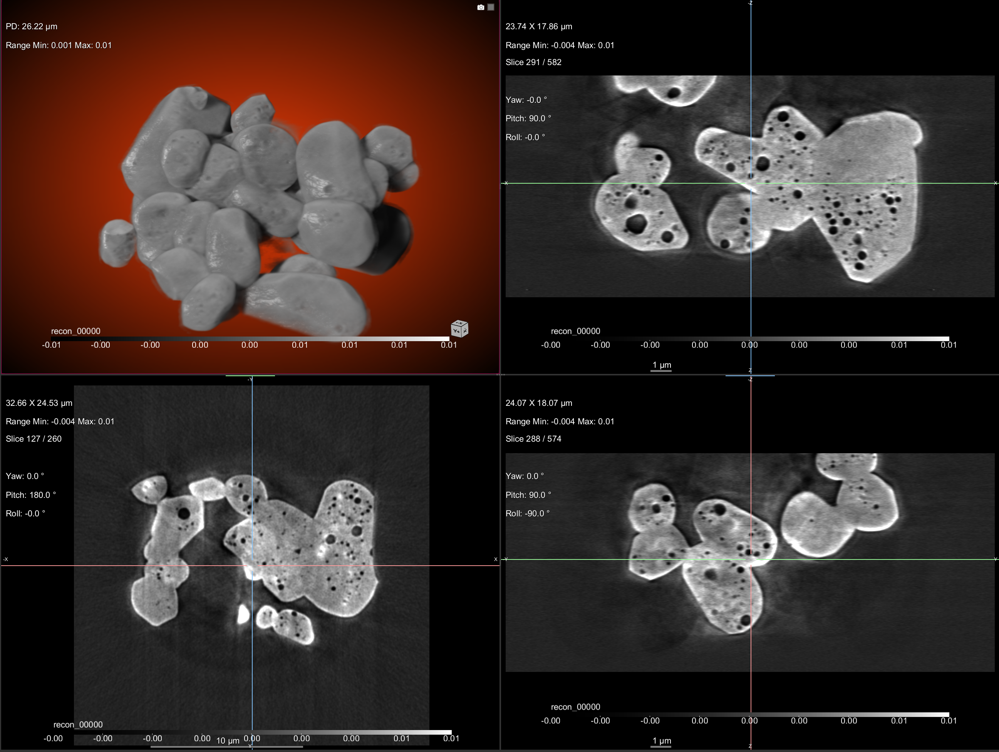

Data Visualization
==================

Raw Data
--------

To view the tomographic raw data we suggest to install `Fiji <https://imagej.net/Fiji>`_ and add `this HDF plugin <https://github.com/paulscherrerinstitute/ch.psi.imagej.hdf5>`_.

Other options are `hdfview <https://support.hdfgroup.org/products/java/hdfview/>`_ or 
`argos <https://github.com/titusjan/argos>`_.

Reconstructed Data
------------------

Dragonfly
~~~~~~~~~

After your data are reconstructed you can visualize using `Dragonfly <https://www.theobjects.com/dragonfly/index.html>`_

Login at the beamline Linux machine and then type::

	[usertxm@txmthree]$ cd /local/usertxm/software/dragonfly
	[usertxm@txmthree]$ ./Dragonfly

Avizo
~~~~~

After your data are reconstructed you can visualize using Avizo.

Login at the beamline Linux machine and then type:

[tomo@handyn]$ cd /local/AmiraAvizo3D/2021.1/bin/
[tomo@handyn]$ ./Avizo3D

Gallery
~~~~~~~

Below is a 3D rendering image gallery of recently measured samples using `Dragonfly <https://www.theobjects.com/dragonfly/index.html>`_.

+-------------------------------------------------------------+----------------+----------------------------+
|                        Sample/Description                   | resolution(nm) |       Images               |
+=============================================================+================+============================+
|                                                             |       50       |       |d00001|             |
+-------------------------------------------------------------+----------------+----------------------------+
