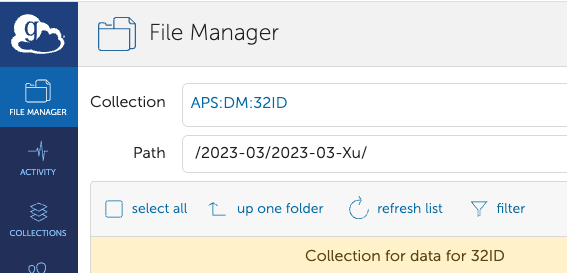

Data Management
===============

Restore
-------

To restore an experiment, e.g. 2023-03-Xu, from tape to its original location on voyager

::

    (base) usertxm@txmthree ~ $ source /home/dm_id/etc/dm.setup.sh
    (dm-user) usertxm@txmthree ~ $ dm-restore-experiment --experiment 2023-03-Xu
    id=0293f99b-c724-402f-af94-1f2606499d96 name=restoreArchive experimentName=2023-03-Xu status=pending 

Download
--------

To download an experiment, e.g. 2023-03-Xu, from voyager to /data/ (mouting point for example of tomodata1:/data/)

::

    (base) usertxm@txmthree ~ $ source /home/dm_id/etc/dm.setup.sh
    (dm-user) usertxm@txmthree ~ $ dm-download --experiment 2023-03-Xu --destination-directory  /data/

For more details see the `DM instruction <https://confluence.aps.anl.gov/display/DMGT/2-BM+Deployment>`_.
