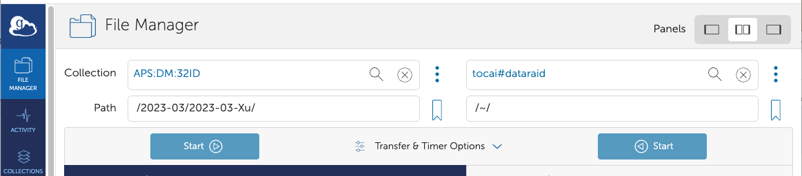

Data Management
===============

Restore
-------

To restore an experiment, e.g. 2023-03-Xu, from tape to its original location on voyager

.. image:: img_guide/voyager_on_globus_01.png 
   :width: 250px
   :align: center
   :alt: dm

::

    (base) usertxm@txmthree ~ $ source /home/dm_id/etc/dm.setup.sh
    (dm-user) usertxm@txmthree ~ $ dm-restore-experiment --experiment 2023-03-Xu
    id=0293f99b-c724-402f-af94-1f2606499d96 name=restoreArchive experimentName=2023-03-Xu status=pending 

Download
--------

You can download data stored on Voyager directly using `Globus <https://www.globus.org/>`_. Simply select your beamline collection (e.g., APS:DM:32ID), navigate to the experiment path (e.g., /2023-03/2023-03-Xu), and choose the specific datasets to download. In the Globus destination window, select your desired folder on your computer.

To download an entire experiment (e.g., 2023-03-Xu) from Voyager to /data/ (e.g., the mount point for tomodata1:/data/), you can use the dm-download command as follows:

::

    (base) usertxm@txmthree ~ $ source /home/dm_id/etc/dm.setup.sh
    (dm-user) usertxm@txmthree ~ $ dm-download --experiment 2023-03-Xu --destination-directory  /data/

For more details see the `DM instruction <https://confluence.aps.anl.gov/display/DMGT/2-BM+Deployment>`_.
