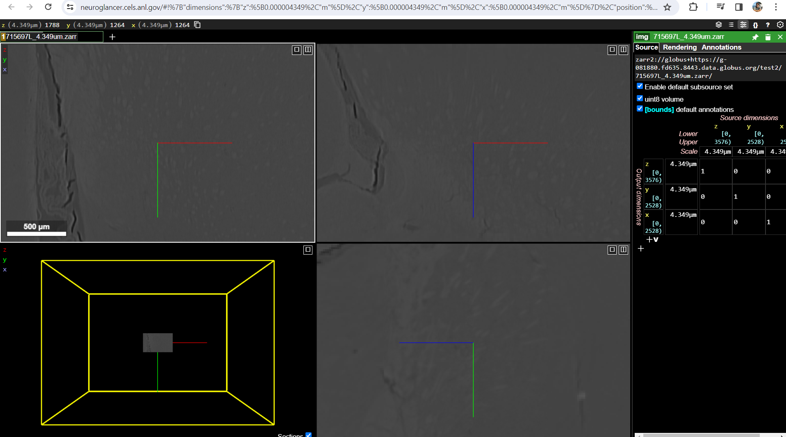
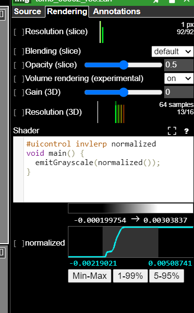

Data Visualization
==================

Raw Data
--------

To view the tomographic raw data we suggest to install `Fiji <https://imagej.net/Fiji>`_ and add 
the `HDF plugin <https://github.com/paulscherrerinstitute/ch.psi.imagej.hdf5>`_

Other options are `hdfview <https://support.hdfgroup.org/products/java/hdfview/>`_ or 
`argos <https://github.com/titusjan/argos>`_

To view the tomographic raw data we suggest to install `Fiji <https://imagej.net/Fiji>`_ and add 
the `HDF plugin <https://github.com/paulscherrerinstitute/ch.psi.imagej.hdf5>`_

Other options are `hdfview <https://support.hdfgroup.org/products/java/hdfview/>`_ or 
`argos <https://github.com/titusjan/argos>`_

Reconstructed Data
------------------

Dragonfly
~~~~~~~~~

After your data are reconstructed you can visualize using `Dragonfly <https://www.theobjects.com/dragonfly/index.html>`_

Login at the beamline Linux machine and then type::

	[usertxm@txmthree]$ cd /local/usertxm/software/dragonfly
	[usertxm@txmthree]$ ./Dragonfly

Gallery
~~~~~~~

Below is a 3D rendering image gallery of recently measured samples using `Dragonfly <https://www.theobjects.com/dragonfly/index.html>`_.

.. |d00001| image:: ../img/dragonfly_01.png
   :width: 50px
   :alt: dragonfly_01

+-------------------------------------------------------------+----------------+----------------------------+
|                        Sample/Description                   | resolution(nm) |       Images               |
+=============================================================+================+============================+
|                                                             |       50       |       |d00001|             |
+-------------------------------------------------------------+----------------+----------------------------+

Neuroglancer
------------

To view the tomographic reconstructed data you can use the Neuroglancer server hosted by ALCF `ALCF Neuroglancer <https://neuroglancer.cels.anl.gov/>`_.

The data link to be used in source has the following syntax::

	zarr2:://globus+https://your-zarr-file-path.zarr

Neuroglancer data Visualization

To adjust the contrast, you can use the Palette on the top right 
   

