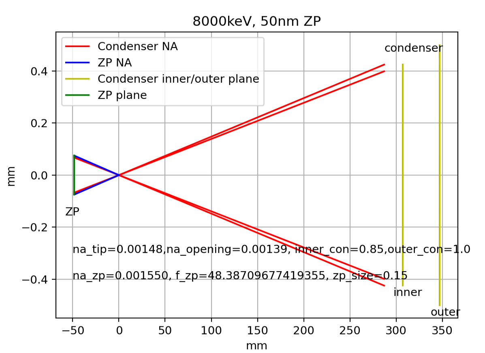

Optics Calculations
===================

Optics positions and resolution levels for for different TXM energies and Freshnel Zone Plates (FZP) can be calculated with using the following spreadsheet:

`xlsx spreadsheet <https://anl.box.com/s/c2wx7t77ln04oxscygu75vnb7ecu6zxu>`_.

.. image:: ../img/Optics.png
   :width: 800px
   :align: center
   :alt: project
   

Zone plate illumination can be modelled with https://github.com/nikitinvv/txm_optics

