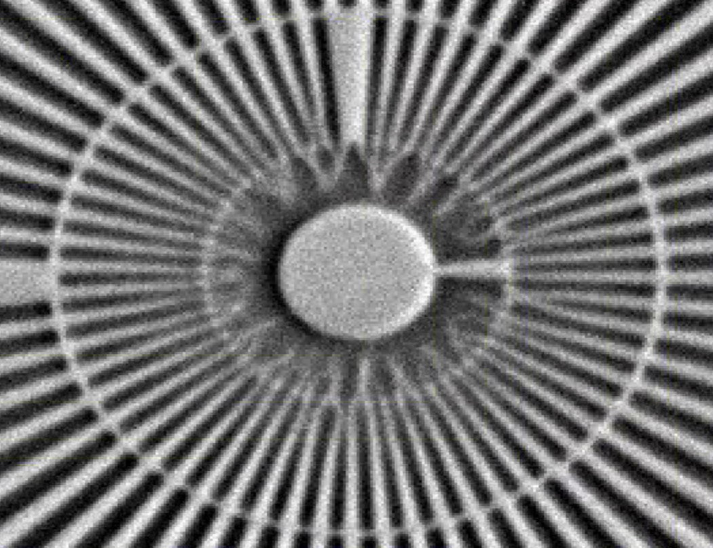
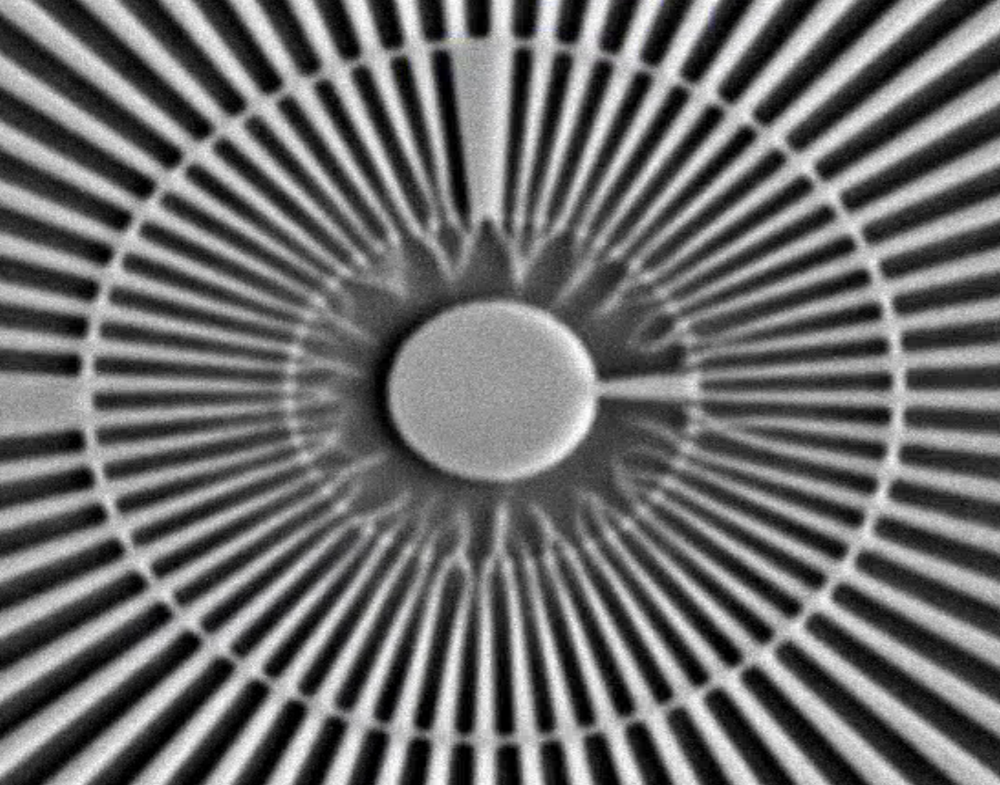
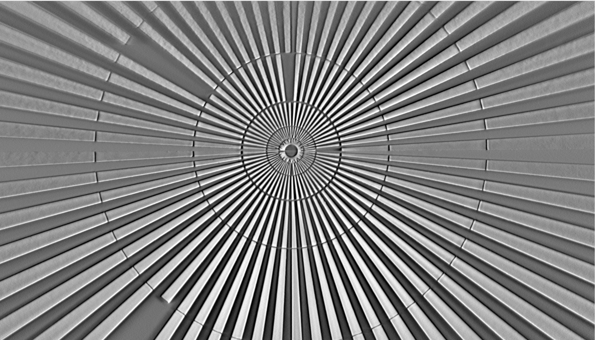

Resolution tests
================

Siemens star

For the tests we used Blackfly S GigE BFS-PGE-161S7M-C: 16.1 MP,  Sony IMX542 camera in 12-bit mode and 2.74 um pixel size. Together with objective lenses we mounted a tube lens yielding the calibrated pixel size of 2.26 um after 5x maginification.

+-----------------------------------------------+-------------------------------------+----------------------------+--------------+
|                        FZP                    | Scintillator (GGG:Eu) thickness     |       Objective            |      Image   |
+===============================================+=====================================+============================+==============+
|                        50 nm                  |           30 um                     |       5x                   |    |d00001|  |
+-----------------------------------------------+-------------------------------------+----------------------------+--------------+
|                        50 nm                  |           23 um                     |       10x                  |    |d00002|  |
+-----------------------------------------------+-------------------------------------+----------------------------+--------------+

Tomography
+-----------------------------------------------+-------------------------------------+----------------------------+--------------+
|                        FZP                    | Scintillator (GGG:Eu) thickness     |       Objective            |      Image   |
+===============================================+=====================================+============================+==============+
|                        50 nm                  |           23 um                     |       10x                  |    |d00003|  |
+-----------------------------------------------+-------------------------------------+----------------------------+--------------+

