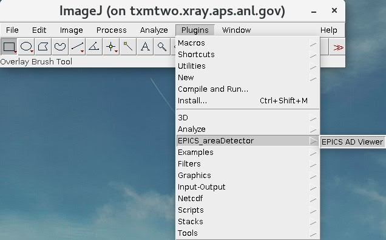

Visualization
=============

ImageJ
------

To start ImageJ Open a terminal::

	[usertxm@txmtwo]$ .... to be completed

Fiji
----

Open a terminal and type::

	[usertxm@txmthree]$ cd /local/Software/Fiji.app
	[usertxm@txmthree]$ /ImageJ-linux64

Dragonfly
---------

After your data are reconstructed you can visualize using `Dragonfly <https://www.theobjects.com/dragonfly/index.html>`_

Login at the beamline Linux machine and then type::

	[usertxm@txmthree]$ cd /local/usertxm/software/dragonfly
	[usertxm@txmthree]$ ./Dragonfly

