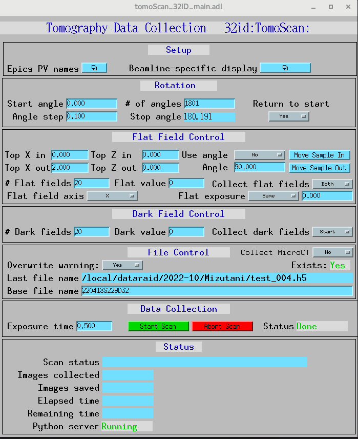

XANES - energy scans
====================

Energy change with calibration
------------------------------

Adjust optics/detector positions for one energy (could be the first one in the list) and Save All PVs to a txt file (e.g. energy8300.txt) through the main TXM GUI:

.. image:: img_guide/energies1.png
   :width: 300px
   :align: center
   :alt: project

Adjust optics/detector positions for another energy (could be the last one in the list) and Save All PVs to a txt file (e.g. energy8400.txt) through the main TXM GUI:

.. image:: img_guide/energies2.png
   :width: 300px
   :align: center
   :alt: project
   
Enter file names for the two energies to the calibration energy GUI (bottom of the main TXM GUI), and switch 'Use calibration' to Yes

.. image:: img_guide/energies3.png
   :width: 300px
   :align: center
   :alt: project

Now energy set function can use the saved optics/detector parameters and interpolate them to any chosen energy, e.g. 8.35 keV. Note interpolation will not be accurate if the energy is very different from the two calibration energies (8.3 keV and 8.4 keV).

Energy scan with Tomoscan
-------------------------

For the energy scan first create a list of energies as .npy file::

	(tomoscan) usertxm@txmtwo ~ $ python
	Python 3.9.7 (default, Sep 16 2021, 13:09:58) 
	[GCC 7.5.0] :: Anaconda, Inc. on linux
	Type "help", "copyright", "credits" or "license" for more information.
	>>> import numpy as np
	>>> energies = np.linspace(8.3,8.5,10)
	>>> energies
	array([8.3       , 8.32222222, 8.34444444, 8.36666667, 8.38888889,
       	       8.41111111, 8.43333333, 8.45555556, 8.47777778, 8.5       ])
	>>> np.save('energies/energies.npy',energies)

Then for the XANES 2D scan switch tomoscan to the step scan mode, set the number of projections (1-10), and number of flat fields (1-10):

 .. image:: img_guide/energies4.png
   :width: 300px
   :align: center
   :alt: project
 
 .. image:: img_guide/energies5.png
   :width: 300px
   :align: center
   :alt: project

Run the energy scan from the command line::

	(tomoscan) usertxm@txmtwo ~ $ tomoscan energy --tomoscan-prefix 32id:TomoScanStep: --file-params1 /home/beams/USERTXM/epics/synApps/support/txmoptics/iocBoot/iocTXMOptics/energy8300.txt --file-params2 /home/beams/USERTXM/epics/synApps/support/txmoptics/iocBoot/iocTXMOptics/energies8400.txt --file-energies energies/energies.npy
	
For the XANES 3D scan switch tomoscan back to the regular (fly scan) mode, set the number of projections, angular step, number of flat fields, etc:

 .. image:: img_guide/energies6.png
   :width: 300px
   :align: center
   :alt: project

Run the energy scan from the command line by setting the correct prefix::

	(tomoscan) usertxm@txmtwo ~ $ tomoscan energy --tomoscan-prefix 32id:TomoScan: --file-params1 /home/beams/USERTXM/epics/synApps/support/txmoptics/iocBoot/iocTXMOptics/energy8300.txt --file-params2 /home/beams/USERTXM/epics/synApps/support/txmoptics/iocBoot/iocTXMOptics/energies8400.txt --file-energies energies/energies.npy

	

	

