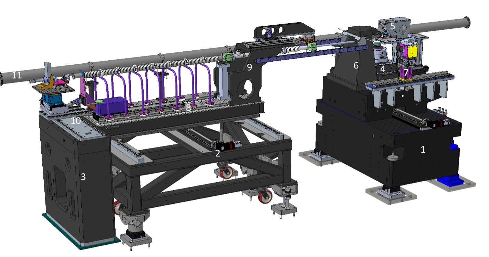

Overview
========

**The in-house Transmission X-ray Microscope of APS for in situ nano-tomography**

Instrument design
-----------------

+-------+---------------------------------------------+
| Label | Component                                   |
+=======+=============================================+
|  1    |  TXM sample and optic granite stage support |
+-------+---------------------------------------------+
|  2    |  Flight path weldment support               |
+-------+---------------------------------------------+
|  3    |  Detector granite support                   |
+-------+---------------------------------------------+
|  4    |  TXM sample system                          |
+-------+---------------------------------------------+
|  5    |  TXM optics                                 |
+-------+---------------------------------------------+
|  6    |  TXM zone plate and phase ring assembly     |
+-------+---------------------------------------------+
|  7    |  Optical microscope for alignment           |
+-------+---------------------------------------------+
|  8    |  Flight path breadboard and mechanics       |
+-------+---------------------------------------------+
|  9    |  Flight path cantilever to create duck under|
+-------+---------------------------------------------+
|  10   |  Detector stack and follower mechanics      |
+-------+---------------------------------------------+
|  11   |  Bypass instrument flight tube              |
+-------+---------------------------------------------+

Optical Layout
--------------
.. image:: img/Instrument.jpg
   :width: 1000px
   :align: center
   :alt: project

.. image:: img/Beamline_sketch.jpg
   :width: 600px
   :align: center
   :alt: project

.. toctree::
   :glob:
   :maxdepth: 2

   overview/item*

Contacts
--------
| `Viktor Nikitin  <https://www.anl.gov/profile/viktor-nikitin>`_ (vnikitin@anl.gov)
| `Alberto Mittone  <https://www.anl.gov/>`_ (amittone@anl.gov)
| Beamline phone #: (630)252-1832
