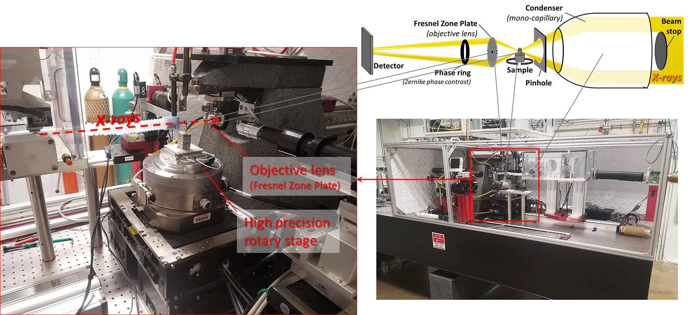
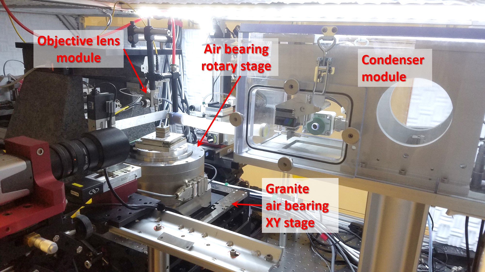
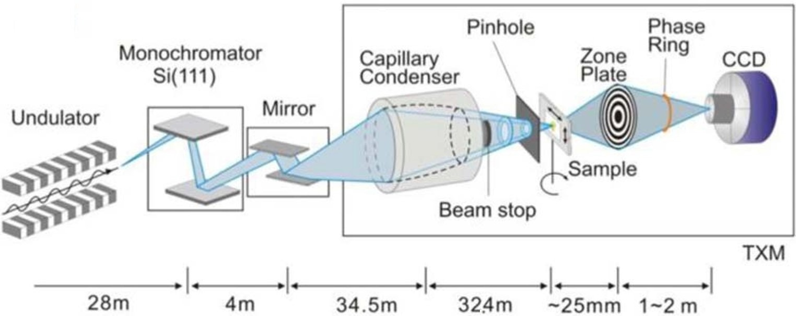

============
Introduction
============

**The in-house Transmission X-ray Microscope of APS (32-ID) for in situ nano-tomography**

Contact
~~~~~~~
| `Viktor Nikitin  <https://www.anl.gov/profile/viktor-nikitin>`_ (vnikitin@anl.gov)
| Beamline phone #: (630) 252-1832

Description
~~~~~~~~~~~
| An in-house Transmission X-ray Microscope (TXM) is in operation at 32-ID-C since 2014. It is a highly modular microscope that can accommodate all sort of sample environment cells for in situ experiments.
| With 16 nm 3D isotropic spatial resolution, this TXM achieved the highest resolution ever documented.
| As evidenced by the `publication list <https://32id-docs.readthedocs.io/en/latest/source/references.html>`_, it is an essential tool for understanding the fundamental interactions of electro-chemical systems such as energy production & storage devices, catalytic reactions, nano-fabrication, corrosion process, biologic cells, rocks, soils, etc.
 
| Relevant information about the instrument capabilities is listed below:
| • **FZP objective lenses (FZP):** 50, 40 and 16 nm ∆r\ :sub:`n`.
| • **Resolution:** typically 50-40 nm, but can be as high as 10 nm 
| • **Typical exposure:** 0.2 s - 1 s per projection.
| • **Energy range:** 6 to 12 keV, ∆E/E = 10\ :sup:`-4`.
| • **Techniques:** combination of nano-scale imaging with absorption, phase contrast  & XANES spectroscopy
| • **Acquisition modes:** step scans, fly scans, interlaced, fast shutter.
| • **Operations** in a wide range of samples environments (T = ambient to 1400 °C, P up to 100 GPa), chemical bath.
| 
| The sample stack is equipped with a high accuracy air bearing rotary stage. The wobble of the rotation axis is as low as 0.2 μrad while the axial and radial rounout is as low as 25 nm. Therefore, tomographic reconstructions can be performed without the challenging extra-step of projections realignment by software.

Resolution & FOV
~~~~~~~~~~~~~~~~
| The table below provides the field of view (FOV) and spatial resolution obtained with the TXM for different X-ray energies, FZPs and distance sample to detector.

.. image:: ../img/optics_new.png
   :width: 800px
   :align: center
   :alt: project

Participants
~~~~~~~~~~~~
| • **Beamline scientist in charge**
|	 • `Vincent De Andrade  <https://www.anl.gov/profile/vincent-de-andrade>`_ (IMG/XSD, vdeandrade@anl.gov)
| • **Beamline integration**
|	 • Alex Deriy (IMG/XSD, deriy@anl.gov)
| • **Mechanical design**
|	 • Sunil Bean (MED/AES)
|	 • Deming Shu (MED/AES)
|	 • Mark Erdmann (MED/AES)
|   • Vincent De Andrade (IMG/XSD)
|   • Alex Deriy (IMG/XSD, deriy@anl.gov)
| • **X-ray optics development**
|   • Michael Wojcik (OPT/XSD)
| • **Controls**
|   • Kevin Peterson (BCDA/AES)
|	 • Tim Mooney (BCDA/AES)
|   • Arthur Glowacki (XSD-SDM)
|   • Alex Deriy (IMG/XSD, deriy@anl.gov)
|   • Francesco De Carlo (IMG/XSD)
|   • Vincent De Andrade (IMG/XSD)
| • **Software development for tomographic reconstructions**
|	 • Doga Gursoy (XSD)
|	 • Tekin Bicer (XSD)
|	 • Viktor Nikitin (IMG/XSD)
|	 • Vincent De Andrade (IMG/XSD)
|	 • Francesco De Carlo (IMG/XSD)
| • **Group leader**
|	 • Francesco De Carlo (IMG/XSD, decarlo@anl.gov)

