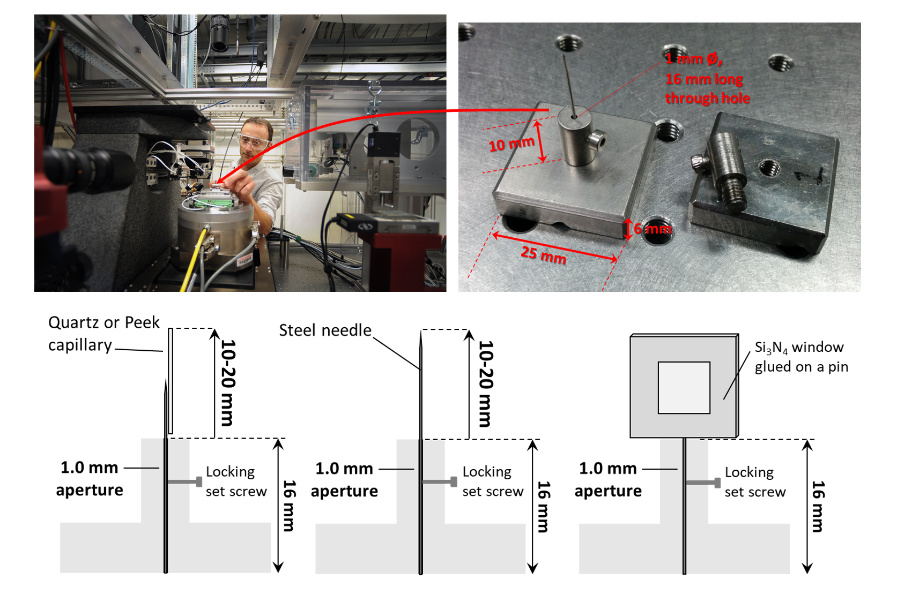
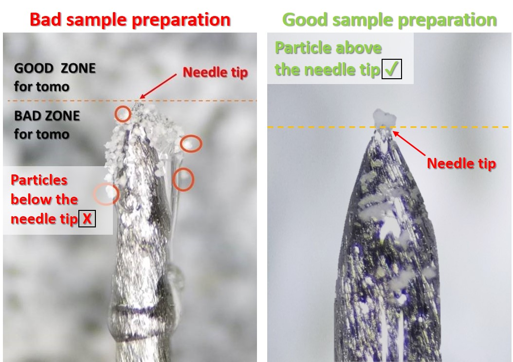
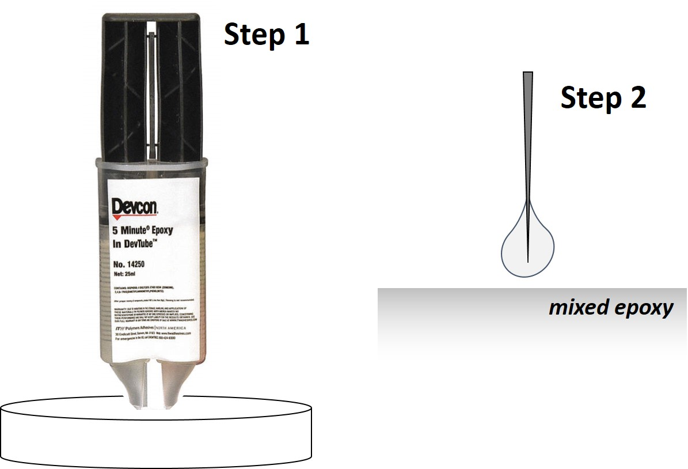
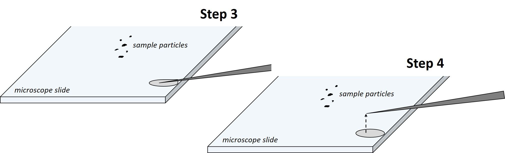

Sample preparation
==================
General considerations
----------------------
| • **IMPORTANT:**
|   **In computed tomography, in order to obtain 3D reconstructions with the highest quality possible, the sample must remain in the field of view at every angles!**
| 
| • Samples are loaded on kinematic mounts designed *in house*. Our kinematic mounts are made out of INVAR, an alloy with very low thermal expansion coefficient in order to minimize drifts during CT acquisitions.
| 
| • Samples are typically mounted on steel needles. If samples are prepared with FIB, they are usually supported on very sharp tungsten needles. We have also performed experiments with samples loaded in `PEEK <https://www.fishersci.com/shop/products/peek-tubing-360-m-o-d-5-ft-5/p-7158677#?keyword=peek+Capillary+Tubes>`_, Kapton or `quartz <https://www.hilgenberg-gmbh.de/en/products/glass-capillaries/>`_ capillaries with 50 µm inner diameter, or fixed on silicon nitride (Si\ :sub:`3`\ N\ :sub:`4`) windows (see sketch below). In case of samples like powder or particles in solution contained into capillaries, it is highly recommanded to use capillaries with an inner diameter as close as possible to the width of the field of view. Also, X-ray absoprtion made by the capillary walls can be assessed  on the `CXRO website <http://henke.lbl.gov/optical_constants/>`_.

| At 32-ID, we typically mount our samples on insects pins (`Bioquip <https://www.bioquip.com/search/DispProduct.asp?pid=1208S000>`_, catalog # 1208S3) because they are very affordable and sharp. Sharp tip facilitates sample mounting with our 3 axis micromanipulator and 5 minutes epoxy.
| Si\ :sub:`3`\ N\ :sub:`4` windows can be obtained from this `provider <https://www.norcada.com/products/xray-microscopy/>`_. 100 or 200 nm of silicon nitride thickness doesn’t make a significant difference in term of X-ray absorption. Windows with 100 or 200 µm frame thickness are more suitable for tomography than thicker ones. While 500 µm thicness provides more robustness to the windows, it increases the amount of missing angles during tomographic acquisitions. A window size of 5x5 mm\ :sup:`2` is a good trade off for nanotomography. Note that (more expensive) Si\ :sub:`3`\ N\ :sub:`4` windows specifically developped for tomography are available `here <https://www.norcada.com/products/xray-tomo-devices/>`_.

.. image:: ../img/micromanipulators.jpg
   :width: 600px
   :align: center
   :alt: project

Examples of bad and good samples for tomography
-----------------------------------------------
| The left image is an example of bad sample preparation. Particles that need to be imaged are below the tip needle and recovered with a lot of epoxy. X-ray tend to damage the epoxy. During acquisition, epoxy can deforms and induce sample motion leading to blurry reconstructions.
| The right image shows a good sample for nanotomography. The particle to be imaged is above the needle tip, is not recovered with epoxy and is smaller than the TXM field of view (~ 50 μm).

Manual sample preparation
-------------------------
| **Step 1:** pour 5 min epoxy in a container and mix for ~30 s (consider using "Devcon 5 minute exopy" since it has been proven to be more beam damage resistant than other type of epoxies).
| **Step 2:** attach a needle to a kinematic mount. Plunge the needle inside the epoxy mixture. A drop of glue will remain on the tip.

 
| **Step 3:** attach the kinematic mount on the micromanipulator. Touch a microscope slide with the tip of the needle to discharge the glue from the tip. Wait for ~2 min for the glue to become more viscous.
| **Step 4:** move the needle away from the puddle. Only a sticky film will remain on the needle tip.

| **Step 5:** using the micromanipulators, grab a particle smaller than the TXM field of view (50 μm typically) with the sticky needle tip. Note that using a suitable approach angle with the needle is important. If the angle is too steep, the particle might end up tilted, not well aligned with the needle. If the angle is too shallow, it might not be possible to grab the particle with the tip of the needle.
| **Step 6:** lift the sample from the slide surface, wait for 5 min.

.. image:: ../img/sple_prep_steps5_6.jpg
   :width: 600px
   :align: center
   :alt: project

