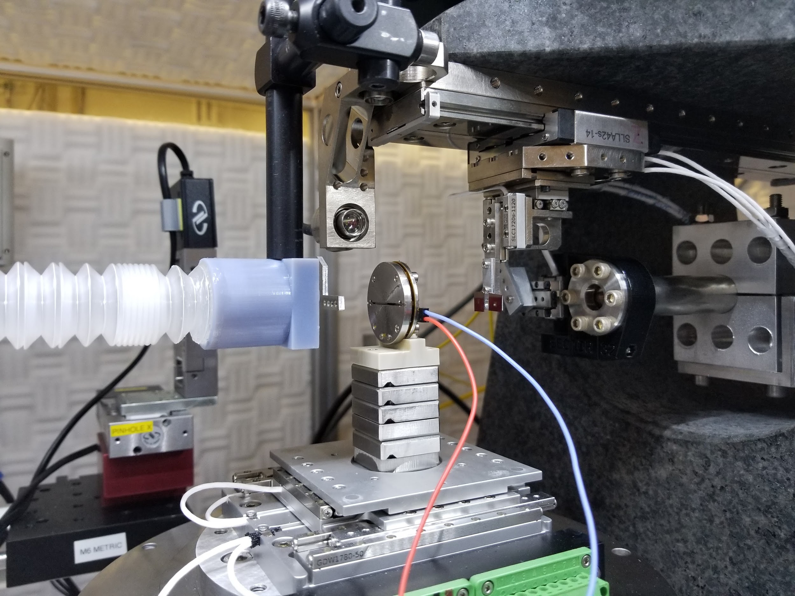
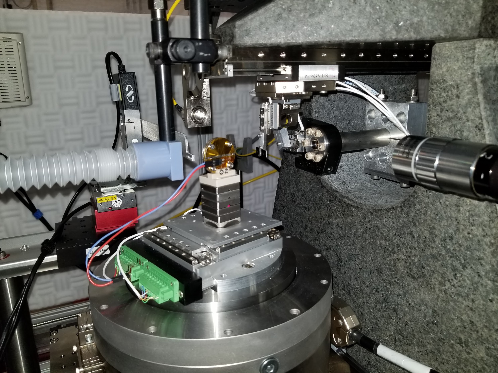
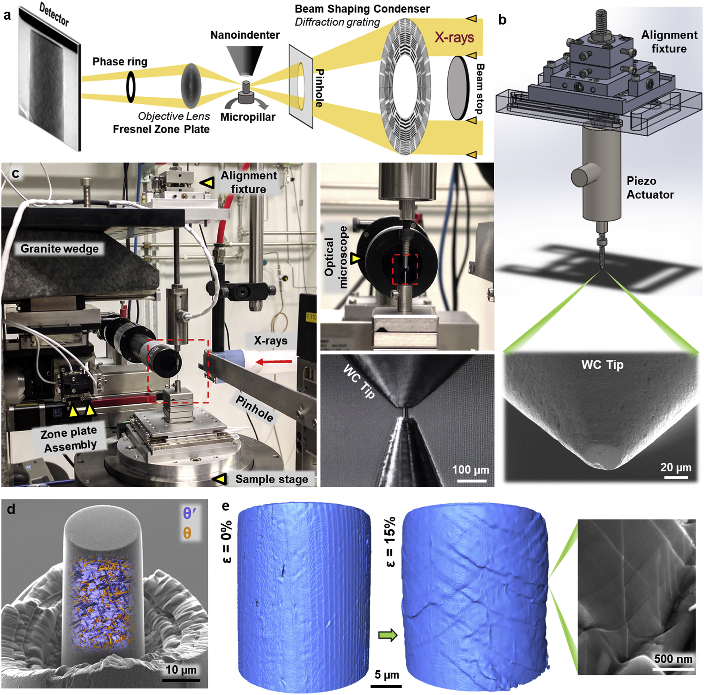

Sample environments
===================

| The TXM has been designed to accomodate different kind of *in situ* cells.
| Our X-ray objective lenses are Fresnel Zone Plates (FZP). They have been designed with large diameter in order to offer a comfortable working distance as shown in the table below:

+------------+------------+------------+
|     Δrn    |   Energy   | work. dist.|
+============+============+============+
|    50 nm   |   8 keV    |     59 mm  |
+------------+------------+------------+
|    40 nm   |   8 keV    |     39 mm  |
+------------+------------+------------+
|    30 nm   |   8 keV    |     29 mm  |
+------------+------------+------------+
|    16 nm   |   8 keV    |     16 mm  |
+------------+------------+------------+

In situ cells for electrochemistry experiments
----------------------------------------------
| Battery cells can be powered through a slip ring placed inside the rotary stage. It means the rotary stage can rotate indefinitely even with electric components plugged over it (see the reen connectors on the Mantis cell pictures below).
| Charge / discharge cycles can be performed with our cycler, a Bio-logic SP150 controlled with the EC-lab software.

Mantis cell
~~~~~~~~~~~
| • A battery coin-cell is being developed *in house* for *operando* measurements (Mark Wolfman). X-ray windows are made of 100 μm thick glassy carbon. While ensuring a good X-ray transmissivity, this material maintains a uniform stack pressure within the cell, allowing the reaction dynamics of the battery material to remain unaffected.

Cells developed by users
~~~~~~~~~~~~~~~~~~~~~~~~

| Battery cell developped by Dr. Zhu's team from IUPUI (Tianyi Li *et al*., 2020 :cite:`li2020situ` in the framework of a study on selenium-doped germanium electrode during (de)lithiation processes.

.. image:: ../img/Zhu_cell.jpg
   :width: 600px
   :align: center
   :alt: project

| **In situ battery cell.** (a) Schematic of the in situ battery cell, (b) SEM image of a pristine Ge electrode on a carbon wire (30 μm) current collector, (c) A TXM image of a pristine Ge electrode in the in situ battery cell, and (d) X-ray transmission rate of the cell components. About 30% of X-ray radiation is absorbed by the quartz capillary, carbon wire, and EC/DEC electrolyte at 11.2 keV.
 

Battery research dedicated lab @ APS
~~~~~~~~~~~~~~~~~~~~~~~~~~~~~~~~~~~~
.. image:: ../img/Electro_lab_Sector11.png
   :width: 600px
   :align: center
   :alt: project

Furnace for *in situ* experiments at high T
-------------------------------------------

| Our furnace is composed of a `MicroFiber Heater FibHeat200_THM_XRD <https://mhi-inc.com/PG4/fiber-heater-microheater.html>`_ able to reach 1900°C. It is enveloped with a Cu cooling socket.
| It is controlled by a `PTC10 controller <https://www.thinksrs.com/products/ptc10.html>`_ integrated with EPICS.

.. image:: ../img/Furnace_1.jpg
   :width: 400px
   :align: center
   :alt: project

| Picture of the *in house* furnace of 32-ID in up position.

.. image:: ../img/Furnace_2.png
   :width: 1000px
   :align: center
   :alt: project

Nano-indenter for *in situ* mechanical testing
----------------------------------------------

| The nano-indenter has been developed by Professor Nik Chawla's group at ASU (Kaira *et al*., 2019 :cite:`kaira2019exploring`). In order to use it, some coordination should be made with this group.

| **In situ nanoindentation testing system.** (a) Schematic illustration showing the synchrotron-based in situ 4D nanomechanical testing setup. (b) Schematic depicting the in situ nanoindenter, with a magnified view of the WC flat tip, fabricated using a focused ion beam (FIB). (c) Instrument setup of the Transmission X-ray Microscope (TXM) as well as the in situ nanoindenter, with magnified views of the WC flat punch and the Al–4%Cu micropillar (T = 350 °C, t = 45 min) fabricated at a needle tip. (d) 3D nanoscale rendering of the alloy's microstructure superimposed over an SEM image of the micropillar. (e) 3D rendering of the micropillar's surface with increasing strain (ε), characterized using the TXM. Multiple slip traces are evident from the micropillar's surface relief. Corresponding SEM image showing slip traces shearing θʹ.

Infrared heater
---------------
The heater can work with temperatures up to 150 °C. 

.. image:: ../img/irlamp1.jpg
   :width: 1000px
   :align: center
   :alt: project

.. image:: ../img/irlamp2.jpg
   :width: 1000px
   :align: center
   :alt: project
