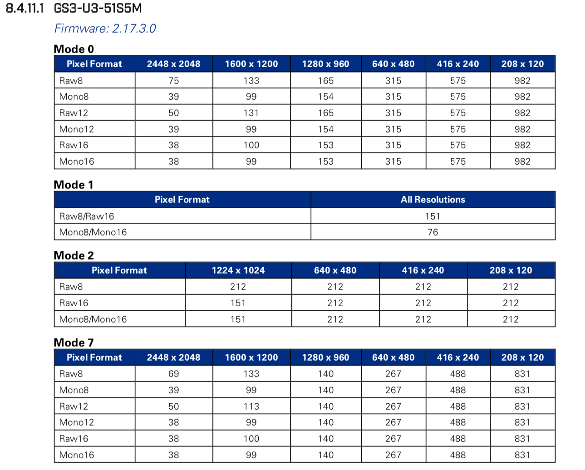
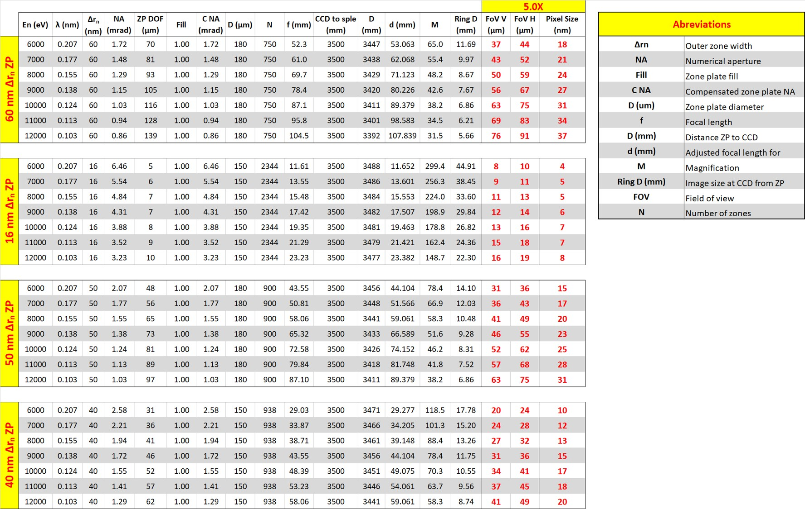

Detection - resolution - FOV
============================

Detection system
----------------
The X-ray detection system consists of camera, lens and scintillator screens. The pixel size and the resolving power of the detection system is not the most relevant information for a TXM since the final resolution and field of view (FOV) depends on the magnification obtained with the Fresnel zone plate objective lens performed in the X-ray regim.

.. _camera_00003:  https://www.ptgrey.com/grasshopper3-50-mp-mono-usb3-vision-sony-pregius-imx250
.. _manual:  https://anl.box.com/s/m8qlbi1dr3jn1l8fwbraar0wvy2y94bk

+-------------------------------------------------------------+--------------+------------------+---------+------------+-------------------+--------------------+--------------------+
|                   Camera                                    | pixels (HxV) | pixels size (μm) |   bit   | fps        | manual            |      FLIR Web doc  | Part number        |
+=============================================================+==============+==================+=========+============+===================+====================+====================+
| Grasshopper3 5.0 MP Mono USB3 Vision (Sony Pregius IMX250)  | 2448 x 2048  |       3.45       | 10      | 75         | manual_           |     camera_00003_  | GS3-U3-51S5M-C     |
+-------------------------------------------------------------+--------------+------------------+---------+------------+-------------------+--------------------+--------------------+

Full technical specification are in manual_.

Frame rates
~~~~~~~~~~~

| This camera is coupled with a Thorlabs 83 mm tube lense and a `5X Mitutoyo Plan Apo HR Infinity Corrected Objective <https://www.edmundoptics.com/p/5x-mitutoyo-plan-apo-hr-infinity-corrected-objective/3634/>`_.
| This combination leads to a pixel size of 1.17 μm.
| Lens resolving power: 1.3 μm
| Lens Depth of Field: 6.2 μm
| Lens NA: 0.21

Resolution & FOV
~~~~~~~~~~~~~~~~

| The table below shows the FOV and spatial resolution obtained with the TXM for different X-ray energies, FZPs and [sample to detector] distances.

