Check lists
===========

Here are check lists for how to operate various TXM components. You can find the starting document at `here <https://anl.box.com/s/fzz3a0z0cfk06wagb45ccbk2brfu8qrj>`_.

Beam Stop
---------

Image will all optics out:

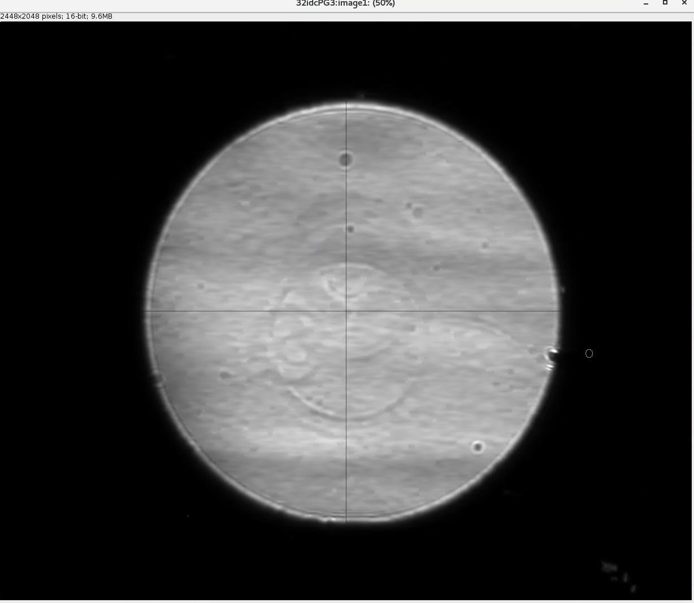

Image with the beam stop in:

.. image:: ../img/txm_beam_stop.png
   :width: 400px
   :align: center
   :alt: project

BPM
---

The IOC can be started with this command::

    usr32idc@txmone% 32idcBPM start

the ioc is located at /net/s32dserv/xorApps/epics/synApps_6_0/ioc/32idcBPM/iocBoot/iocbpm/

CSS and the vendor screens have been installed locally in the usr32idc home directory and can be launched with this command on 32idcws::

    usr32idc@txmone% 32idcBPM css

If the xbpm_SIEPA3P.opi screen isn't open when CSS launches, to do the following:

1. Right click start.opi in the Navigator
2. Open with -> OPI Display (Workbench)
3. Click "Start BPM Display" (the screen opens in the right pane)
4. Drag the screen's tab from the right pane to the center pane

.. image:: ../img/bpm_01.png
   :width: 400px
   :align: center
   :alt: project

On the above window select the KX/KY values (2000/3800) and press enter. Also set the internal bias lebel to 12V and Set the BIAS state to On.

Computers
---------

The 3 main computers used by the TXM are:

- txmone 
- txmtwo: data collection (TomoScan/AreaDetector)
- `txmthree <https://anl.box.com/s/juc23klfd676smulsjj39xuxhd4dz354>`_: data analysis (tomoPy, DragonFly)

Condenser
---------

Here are the capillary condenser specifications:

+-----------+--------------+-------------------+----------------------------+--------------------------+--------------------------------+
| Maker     | Name         |   Source demag    | Entrance aperture (ID: mm) |   Exit aperture (ID: mm) |        Manuals                 |
+-----------+--------------+-------------------+----------------------------+--------------------------+--------------------------------+
| Sigray    | APS_special  |      1000         |             0.75           |         0.45.            | `full specs_01`_, `order_01`_  |
+-----------+--------------+-------------------+----------------------------+--------------------------+--------------------------------+
| X-radia   |              |                   |                            |                          |                                |
+-----------+--------------+-------------------+----------------------------+--------------------------+--------------------------------+
| Zeiss     |              |                   |                            |                          |                                |
+-----------+--------------+-------------------+----------------------------+--------------------------+--------------------------------+

.. _full specs_01: https://anl.box.com/s/soj1mas0tqf8thu4fkl4jcjiqvno6ugf
.. _order_01: https://apps.inside.anl.gov/paris/req.jsp?reqNbr=F8-017035

Condenser alignment
-------------------

When switching mono-capillary condenser, relying on previous motor position is not very reliable, because the manual swapping step tend to cause loss of motor position. 

.. warning:: Please never home the pitch and yaw because it could break the condensers. Tip: tweak the pitch of the condenser until it looks horizontal, checking with the microscope on the encoded tower. Then, make large motions with the Yaw (0.1° steps).

The condenser adaptor holding the Zeiss capillary is also bearing a beam shaping condenser. This should be the high energy beam shaping condenser (double check with Michael Wojcik if need it).

Dimensions on the sketch below are useful for pre-aligning the condenser in X and Y.

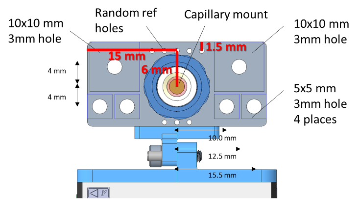

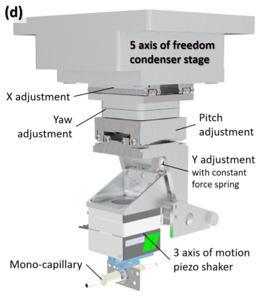

Condenser shaker
----------------

To start the shaker IOC use the short cut on the desktop of the windows 10 machine called "postulate"

::

   xfreerdp /u:usr32idc /d:XRAY /size:1900x1000 /v:postulate /sec:nla

Open the shaker control from:

.. image:: ../img/measCompShaker_01.png
   :width: 400px
   :align: center
   :alt: project

To operate the condenser shaker (piezo jena)

- Waveform A (red curve) controls the vertical sweeping of the condenser
- Waveform B (blue curve) controls the horizontal sweeping of the condenser
- Select the Lissajou trajectory function

“Amp Multiplier” controls the amplitude of the scanning
“Frequency” is the frequency of the red curve. It should be selected according to the exposure time. 

For instance:

- if exposure = 0.5s, frequency should not be 1 or 2 Hz but 0.5 or 1.5 Hz.
- if exposure =1 s, frequency can be 1, 2, 3, 4 Hz, etc.

Favor low frequency to avoid detuning the pitch and yaw of the condenser too quickly.

.. image:: ../img/measCompShaker_03.png
   :width: 400px
   :align: center
   :alt: project

.. warning:: Before using the shaker after a long shutdown, power cycle the shaker controller (see image below) and restart the epics IOC.

.. image:: ../img/measCompShaker_04.png
   :width: 400px
   :align: center
   :alt: project

CRLs
----

To move the CRLs actuators::

    usr32idc@32idbws $ 32idbPLC start | status | stop | medm

The medm user interface is also accessible from the main beamline screen under: <IOC> <32idbPLC> <Digital> <PLC relays with DESC>

.. image:: ../img/plcRelay_top_2.png
   :width: 400px
   :align: center
   :alt: project

.. image:: ../img/plcRelay_top_3.png
   :width: 400px
   :align: center
   :alt: project

DCM
---

First start the main beamline control system with::

    usr32idc@txmone $ ./start_caQtDM_32id

.. image:: ../img/epics_main.png
   :width: 500px
   :align: center
   :alt: project

then select the Kohzu DCM:

.. image:: ../img/dcm.png
   :width: 400px
   :align: center
   :alt: project

Also check that the undulator is set at:

.. image:: ../img/undulator.png
   :width: 200px
   :align: center
   :alt: project

DCM temperature
~~~~~~~~~~~~~~~

You can check the DCM temperature with:

.. image:: ../img/dcm_01.png
   :width: 400px
   :align: center
   :alt: project

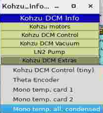

Detector magnification
----------------------

Switching magnification of the detector:

- #2 = middle scintillator = 2X (motor pos = 45)
- #3 = outboard scintillator = 5x (motor pos = 0)
- #1 = inboard scintillator = 5X with tube lens and ESRF thin film scintillator (motor pos = 80)  Important to use this one, the use of a tube lens (thanks Alan!) improve image quality.

Flag
----

Connect to xxx.xx.102.81 and look at the video feed "1". To move the flag up:

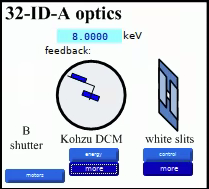

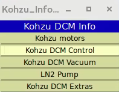

Furnace Control
---------------

::

    usr32idc@32idcws $ 32idcTEMP start
    usr32idc@32idcws $ 32idcTEMP medm

Run this command on txmone::

    usr32idc@txmone $ medm -x -attach -macro "P=32idcTEMP:,T=tc1,CT=heater,CV=out" PTC10.adl &

To read the sample thermocouple open the medm window under <32idcSOFT><TempCtrl><ADAM-4018+>

- Tc 0 = sample thermocouple
- Tc 1 = ambient T

Note: both the PID and output both need to be On for heating to occur.

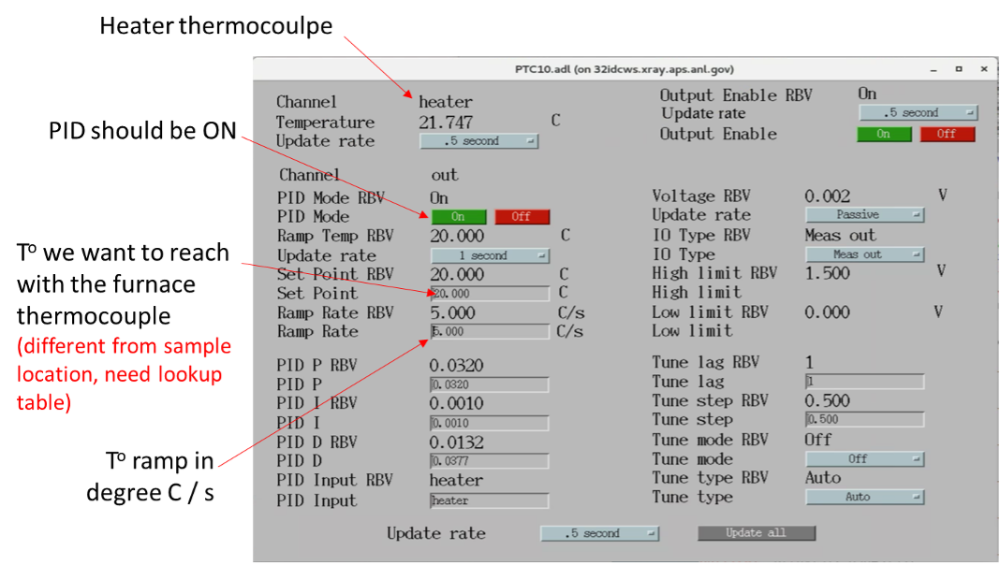

Using Mark’s python script to build a calibration table::

    usr32idc@txmone $ canda activate furnace
    usr32idc@txmone $ python ~/wolfman/furnace_calibration.py

The “main” runs the run_calibration function and save a lookup table in a tsv file format.

- The main function launches a calibration of the furnace using the readback value of a thermocouple located at the sample location.

The user needs to define a temperature vector for which the lookup table value will be recorded::

   temperatures = np.arange(30, 1050, step=20)

- Can read the lookup table and estimate a set value for a wanted temperature. For instance, if one want to know the set value of the furnace to obtain 500oC at the sample location:

To estimate T°::

    usr32idc@txmone $ iptyhon
    In [1]: from furnace_calibration import calibrate_temperature
    In [2]: calibrate_temperature("furnace_calibration_2020-11-28.tsv", 500)

He flow control
---------------

The medm user interface is accessible from the main beamline screen under: <IOC> <32idcTXM> <new> <Analox He Sensor>

.. image:: ../img/he_sensor_01.png
   :width: 400px
   :align: center
   :alt: project

.. image:: ../img/he_sensor_02.png
   :width: 400px
   :align: center
   :alt: project

.. image:: ../img/he_sensor_03.png
   :width: 400px
   :align: center
   :alt: project

He valve control
----------------

::

    usr32idc@32idcws $ 32idcPLC start

The medm user interface is accessible from the main beamline screen under: <IOC> <32idcPLC> <DAC> <PLC DAC>

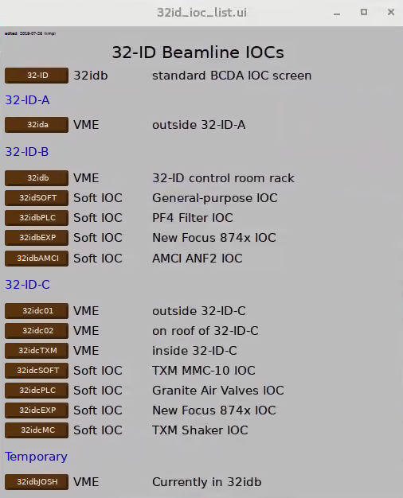

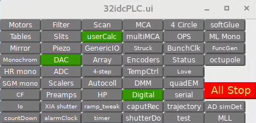

.. image:: ../img/plc_dac.png
   :width: 400px
   :align: center
   :alt: project

- ao1 VAL = 0 -> valve closed
- ao1 VAL = 1 -> valve fully opened
- ao1 VAL = 2.35 -> constant amount of He in the condenser enclosure (might varies if system more or less leaky

Magnification
-------------

Optic magnification calculation to generate tables use this `xlsx spreadsheet <https://anl.box.com/s/ayqcs8zaeozijwkv6z4thl03j94ipmci>`_.

.. image:: ../img/Optics.png
   :width: 800px
   :align: center
   :alt: project

Mirror
------

.. image:: ../img/mirror.png
   :width: 400px
   :align: center
   :alt: project

.. image:: ../img/mirror_energy.png
   :width: 400px
   :align: center
   :alt: project

Newport XPS
-----------

Newport motors/Controller 3 only:

http://s32xps4.xray.aps.anl.gov/cgi/post.cgi

Restarting the drivers:

1) turn ON driver
2) reset the IOC
3) go on set mode
4) type enter in the dial box

Phase Ring
----------

To move the phase ring you need to start the Micronix Piezo stages controller IOC::

    usr32idc@txmone $ 32idcSOFT start | status | stop | medm

medm start the standard EPICS ioc medm. To get the UI to control the Micronix stages.

then

Low Z Siemens star with phase ring out:

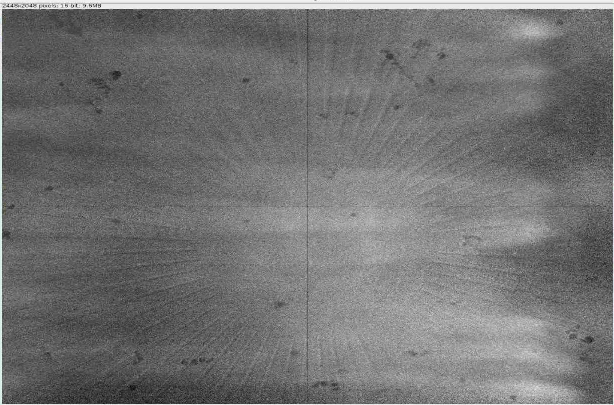

Low Z Siemens star with phase ring in:

.. image:: ../img/phase_ring_in.png
   :width: 400px
   :align: center
   :alt: project   

PID control
-----------

The BPM PID control parametes are accessible from: 

Horizontal:

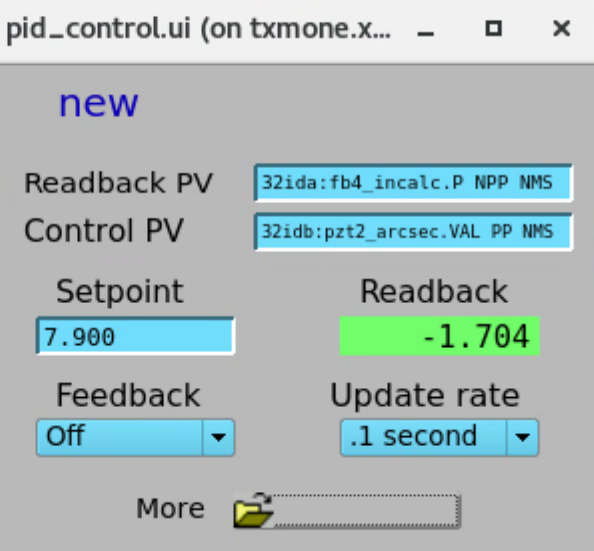

Vertical:

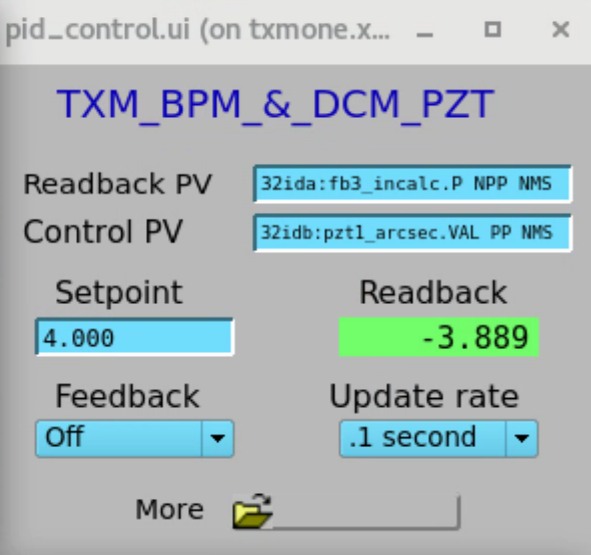

Point Gray camera
-----------------

.. _camera_order_00001: https://apps.inside.anl.gov/paris/req.jsp?reqNbr=F5-293065
.. _camera_00001:  https://www.ptgrey.com/grasshopper3-91mp-mono-usb3-vision-sony-icx814-camera 

+-------------------------------------------------------------+--------------+------------------+---------+------------+--------------------+-----------------------------------------+-------------------------------+
|                   Camera                                    | pixels (HxV) | pixels size (μm) |   bit   | fps        |      Manual        | Part number                             |          Purchase orider      |
+=============================================================+==============+==================+=========+============+====================+=========================================+===============================+
| Grasshopper3 5.0 MP Mono USB3 Vision (Sony Pregius IMX250)  | 2448 x 2048  |       3.45       | 10      | 75         |     camera_00001_  | GS3-U3-51S5M-C                          |   camera_order_00001_         |
+-------------------------------------------------------------+--------------+------------------+---------+------------+--------------------+-----------------------------------------+-------------------------------+

This is the main TXM detector, to start, stop, medm use::

    usr32idc@txmone $ 32idcPG1 start | status | stop | medm

to change lens:

.. image:: ../img/visible_light_objective.png
   :width: 200px
   :align: center
   :alt: project

Python scripts
--------------

Control script location is::

    usr32idc@txmone $ cd ~/TXM_control/pg/

**In_Out_positions**::

    usr32idc@txmone $ cd ~/TXM_control/pg/
    usr32idc@txmone $ ls In_Out_positions.py

To run this script use the “All_in” and “All_out” in the main TXM user interface

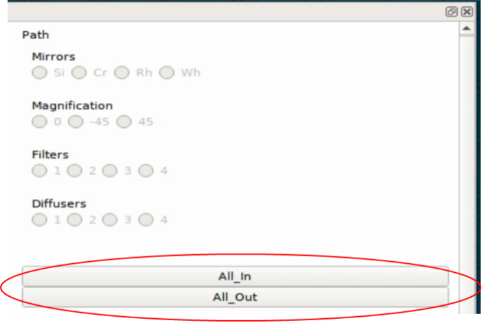

It allows to automate the motion of several TXM stages when the operator wants to switch to a large view (direct beam -> “All_out”) and TXM view (diffuser, CRLs, pinhole, beamstop, ZP and condenser in -> “All_in”).
The python script contains the IN and OUT positions of the stages and also readjusts other parameters like the readback values for the closed loop between the DCM and the BPM, camera settings (exposure time, flipping the image).

Challenge: checking the BPM readback value with and without the CRLs IN and write down the values in “In_Out_positions.py”, in the functions “All_In()”  and “ All_Out” . These readback values change with the energy unfortunately, it is especially true when using the Silicon BPM rather than the Diamond BPM.

**XANES and energy changes**::

    usr32idc@txmone $ /local/usr32idc/backup/TXM/run/energy_scan.py
    usr32idc@txmone $ /local/usr32idc/backup/TXM/run/move_energy.py

Queensgate
----------

.. image:: ../img/queensgate_00.png
   :width: 200px
   :align: center
   :alt: project

.. image:: ../img/queensgate_01.png
   :width: 200px
   :align: center
   :alt: project

.. image:: ../img/queensgate_02.png
   :width: 400px
   :align: center
   :alt: project

Rotary stage
------------

To home the rotary stage hit HomeR or HomeF in the motor control screen:

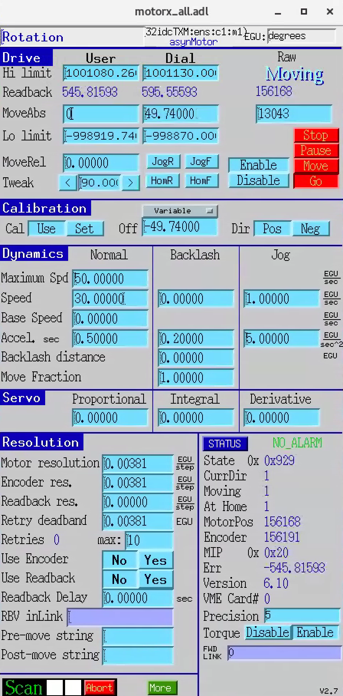

then set the user position at 130.26°

We motor controller is an Aerotech Ensemble:

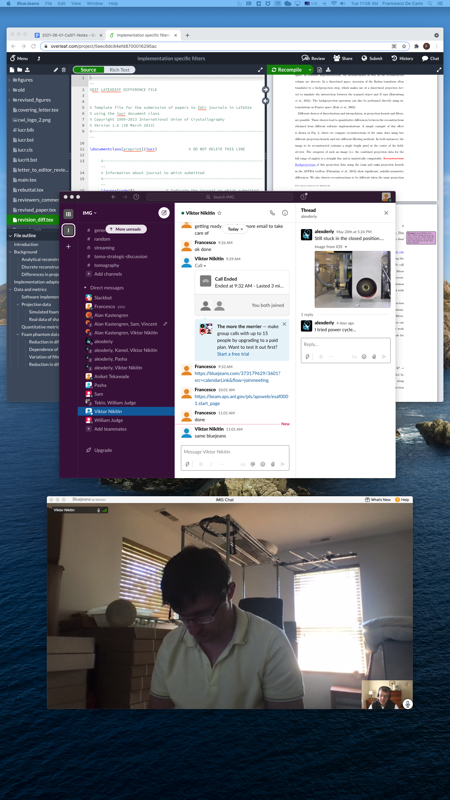

Scintillator 
------------

Scintillator focus and 2 tilts are adjustable using:

**focus** (adjustment along Z) is controlled with a new port stage accessible from an EPICS IOC running on windows 10 machine called "sec32lt04". To start the IOC

::

  [usr32idc@txmtwo]$ xfreerdp /u:usr32idc /size:1900x1000 /v:sec32lt04 /sec:nla

or::

  [usr32idc@txmtwo]$ ~/remote_sec32lt04

then run:

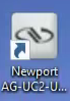

The focus motor control is accessible from the main txm user interface.

**tilt adjustments**

::

   usr32idc@txmone $ ./start_caQtDM_32id

then select:

.. image:: ../img/new_focus_02.png
   :width: 400px
   :align: center
   :alt: project

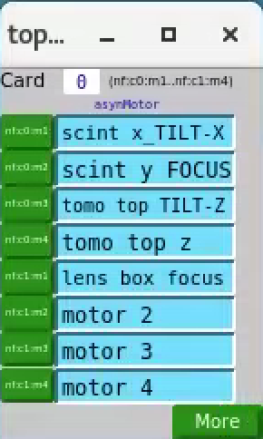

Shutter
-------

The TXM has a fast shutter accessible from the 32idcTXM IOC under new/uniblitz:

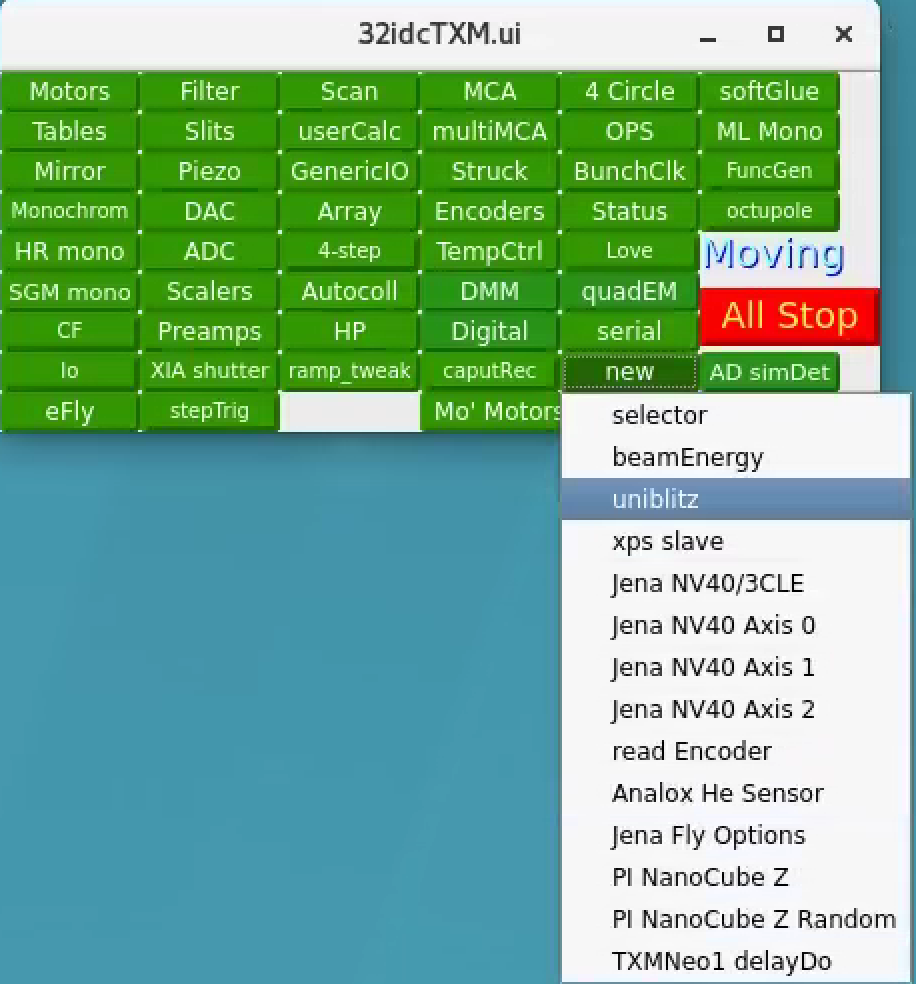

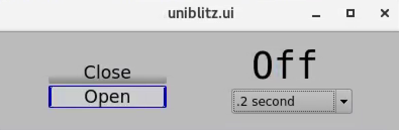

For more information check the `shutter manual <https://anl.box.com/s/obtafsy1uaz54jyl60teellhippmbwr1>`_.

Siemens Star
------------

using the 40 nm Zone Plate:

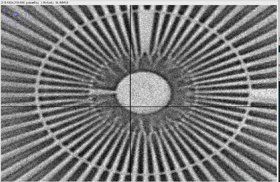

using the 50 nm Zone Plate:

.. image:: ../img/siemens_star_50nmFZP.png
   :width: 400px
   :align: center
   :alt: project

using the 16 nm Zone Plate:

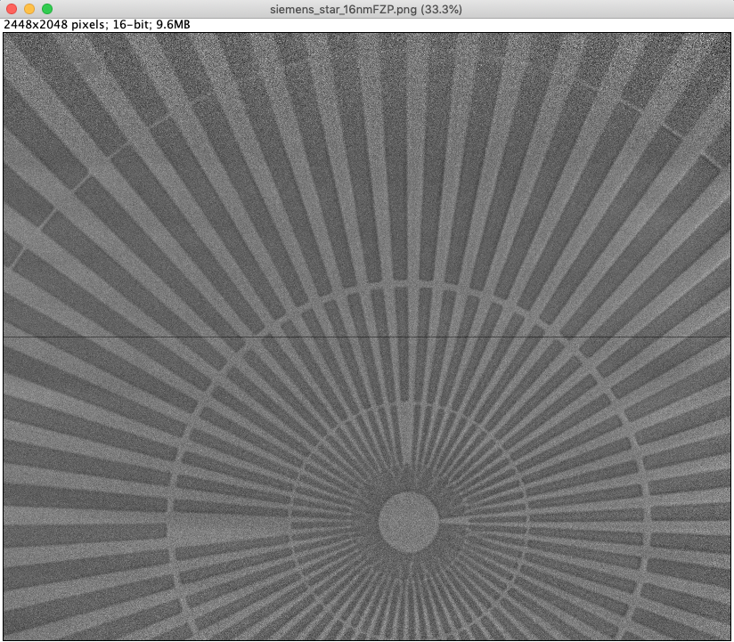

zone plate selfy using the 16 nm Zone Plate:

.. image:: ../img/zp_selfie_16nmFZP.png
   :width: 400px
   :align: center
   :alt: project

TomoScan
--------

To start the tomoScan ioc::

   usertxm@txmtwo $ start_ioc.sh

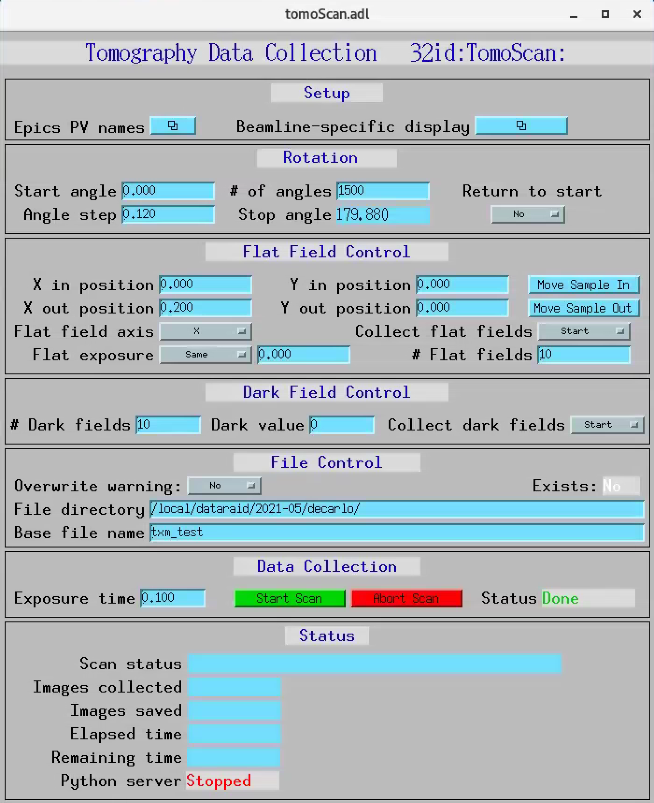

User Interface
--------------

To start the TXM user interface::

    usertxm@txmtwo $ start_txm

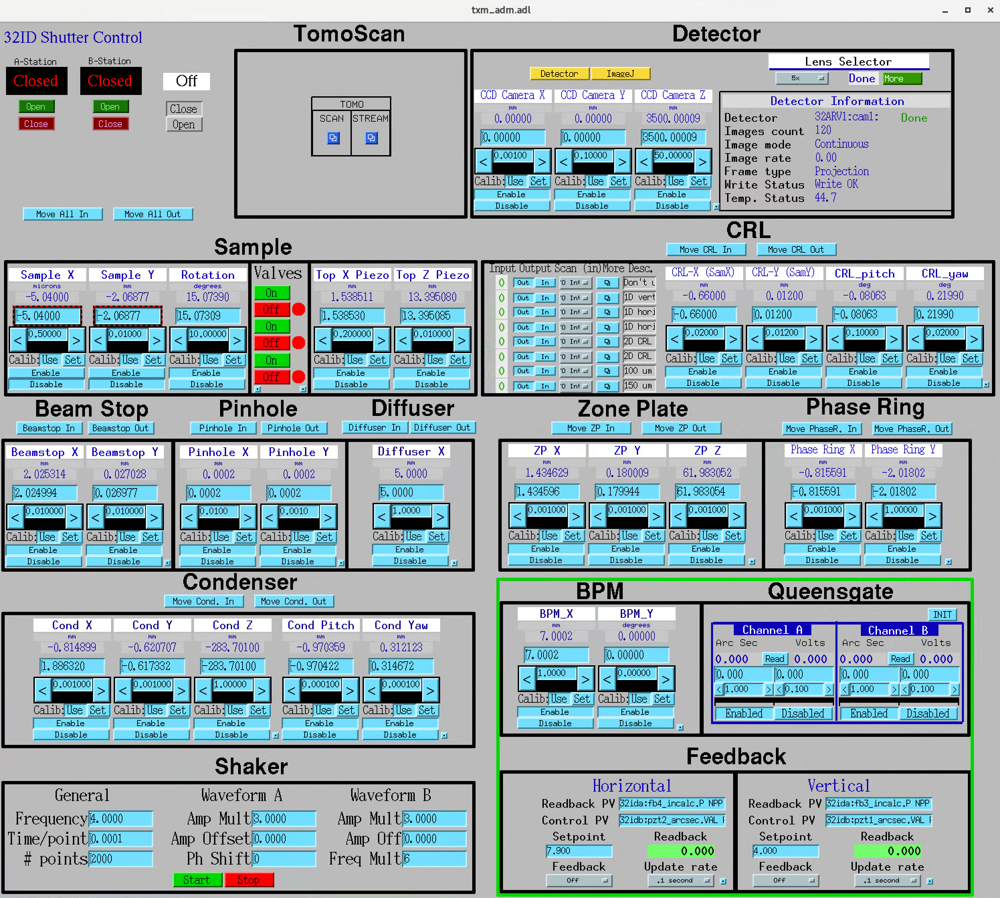

XY stages
---------

To move the air bearing XY stages::

    usr32idc@32idbws $ 32idbPLC start

The medm user interface is accessible from the main beamline screen under: <IOC> <32idbPLC> <Digital> < Granite air valves (caQtDM only)>

X and Y can’t be actuated with “Stage High-Pressure” ON.

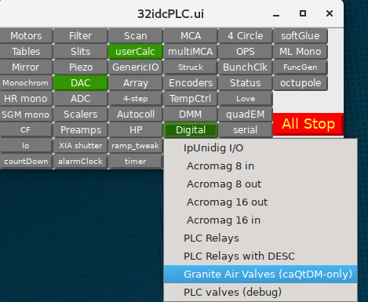

.. image:: ../img/graniteAirValves_3.png
   :width: 400px
   :align: center
   :alt: project

Web Cam
-------

webcams are accessible from::

    32-ID-B: xxx.xx.102.71
    32-ID-B: xxx.xx.102.89
    32-ID-C: xxx.xx.102.90
    32-ID-C: xxx.xx.102.88
    

High resolution setup 
-------
date: 06/30/21
note: condenser was at -44.2

.. image:: ../img/high-res-setup.png
   :width: 400px
   :align: center
   :alt: project
